# VeryReport

**企业级 BI 与报表平台 —— 一套系统覆盖复杂报表、自助分析、数据填报、ETL、数据大屏与 AI 问数。**

> 让报表开发与数据分析在同一套语义口径上完成，把数据从接入到决策的链路收敛到一个平台内。

[](https://www.veryreport.com)
[](https://www.veryreport.com)
[](https://www.veryreport.com)
[](https://www.veryreport.com)
[](https://www.veryreport.com)
[](https://www.veryreport.com)
[](https://www.veryreport.com)
[](https://www.veryreport.com)

**语言 / Language / 言語**

[English](README.md) · **中文（当前）** · [日本語](README.ja-JP.md)

---

## 目录

- [VeryReport 是什么](#veryreport-是什么)
  - [一分钟了解](#一分钟了解)
  - [核心定位](#核心定位)
  - [技术栈](#技术栈)
  - [产品形态](#产品形态)
- [为什么选择 VeryReport](#为什么选择-veryreport)
  - [设计取向](#设计取向)
  - [适合哪些企业](#适合哪些企业)
  - [不适合哪些场景](#不适合哪些场景)
  - [相比传统 BI](#相比传统-bi)
  - [相比 Excel](#相比-excel)
  - [相比 Power BI](#相比-power-bi)
  - [相比 Tableau](#相比-tableau)
  - [相比 FineBI](#相比-finebi)
- [功能矩阵](#功能矩阵)
  - [数据接入与集成](#数据接入与集成)
  - [数据建模与语义层](#数据建模与语义层)
  - [报表能力](#报表能力)
  - [自助分析与仪表板](#自助分析与仪表板)
  - [数据大屏](#数据大屏)
  - [数据填报与流程](#数据填报与流程)
  - [AI 能力](#ai-能力)
  - [调度与分发](#调度与分发)
  - [导出与打印](#导出与打印)
  - [移动端](#移动端)
  - [权限与多租户](#权限与多租户)
  - [集成与嵌入](#集成与嵌入)
  - [运维与可观测](#运维与可观测)
  - [扩展与插件](#扩展与插件)
- [产品截图](#产品截图)
- [系统架构](#系统架构)
  - [整体架构](#整体架构)
  - [请求链路](#请求链路)
  - [查询执行流程](#查询执行流程)
  - [部署拓扑](#部署拓扑)
  - [数据模型分层](#数据模型分层)
- [支持的数据源](#支持的数据源)
  - [关系型数据库](#关系型数据库)
  - [国产与信创数据库](#国产与信创数据库)
  - [数据仓库与 OLAP](#数据仓库与-olap)
  - [大数据与湖仓](#大数据与湖仓)
  - [NoSQL 与检索引擎](#nosql-与检索引擎)
  - [文件与接口](#文件与接口)
  - [数据源能力矩阵](#数据源能力矩阵)
- [AI 能力详解](#ai-能力详解)
  - [Chat BI 与自然语言问数](#chat-bi-与自然语言问数)
  - [AI SQL](#ai-sql)
  - [AI Dashboard](#ai-dashboard)
  - [AI Insight](#ai-insight)
  - [语义层与口径治理](#语义层与口径治理)
  - [LLM 接入与模型管理](#llm-接入与模型管理)
  - [MCP 与 Tool Calling](#mcp-与-tool-calling)
  - [Agent 编排](#agent-编排)
  - [RAG 知识增强](#rag-知识增强)
  - [AI 可审计性](#ai-可审计性)
- [仪表板与可视化](#仪表板与可视化)
- [报表能力详解](#报表能力详解)
- [ETL 与数据集成](#etl-与数据集成)
- [数据填报与工作流](#数据填报与工作流)
- [部署方式](#部署方式)
  - [Docker](#docker)
  - [Docker Compose](#docker-compose)
  - [Kubernetes](#kubernetes)
  - [Helm](#helm)
  - [Linux 安装包](#linux-安装包)
  - [Windows 安装包](#windows-安装包)
  - [macOS 本地开发](#macos-本地开发)
  - [私有云与公有云](#私有云与公有云)
  - [信创环境](#信创环境)
  - [高可用部署](#高可用部署)
- [快速开始](#快速开始)
  - [环境要求](#环境要求)
  - [第一步 下载与安装](#第一步-下载与安装)
  - [第二步 启动服务](#第二步-启动服务)
  - [第三步 连接 MySQL](#第三步-连接-mysql)
  - [第四步 创建数据集](#第四步-创建数据集)
  - [第五步 创建仪表板](#第五步-创建仪表板)
  - [第六步 生成报表](#第六步-生成报表)
  - [第七步 配置定时调度](#第七步-配置定时调度)
  - [第八步 启用 AI 问数](#第八步-启用-ai-问数)
- [应用示例](#应用示例)
- [模板中心](#模板中心)
- [REST API 与 SDK](#rest-api-与-sdk)
  - [认证](#认证)
  - [核心接口](#核心接口)
  - [OpenAPI 规范](#openapi-规范)
  - [Java SDK](#java-sdk)
  - [Python SDK](#python-sdk)
  - [Go SDK](#go-sdk)
  - [Node.js SDK](#nodejs-sdk)
  - [Webhook 事件](#webhook-事件)
  - [错误码](#错误码)
- [常见问题](#常见问题)
- [产品对比](#产品对比)
- [路线图](#路线图)
- [社区](#社区)
- [参与贡献](#参与贡献)
- [许可与版本](#许可与版本)
- [关键词索引](#关键词索引)

---

## VeryReport 是什么

VeryReport 是一个企业级 Business Intelligence（商业智能）与报表平台，用于在企业内部完成从数据接入、清洗建模、报表制作、自助分析到 AI 问数的完整链路。项目由中创微（上海）软件有限公司研发与维护。

平台的设计出发点是一个在中国企业环境中反复出现的问题：**报表系统与 BI 系统通常是两套产品，各自维护一份数据口径。** 财务部门用报表工具做审计报表，业务部门用 BI 工具做分析看板，两边的「销售额」算出来不一样，最终在经营会议上花时间对数而不是做决策。

VeryReport 把 Pixel Perfect 报表引擎与自助分析引擎放在同一套语义模型之上，两者消费相同的指标定义、相同的行列级权限。这是它与「纯报表工具」和「纯 BI 工具」的主要结构差异。

### 一分钟了解

```text
数据源  ──▶  数据集成 ETL  ──▶  语义模型（指标 / 维度 / 权限）
                                        │
                    ┌───────────────────┼───────────────────┐
                    ▼                   ▼                   ▼
              复杂报表引擎         自助分析引擎          Vera AI 问数
             （Pixel Perfect）    （拖拉拽 / 钻取）    （自然语言 / Agent）
                    │                   │                   │
                    └───────────────────┼───────────────────┘
                                        ▼
                          仪表板 · 大屏 · 移动端 · 定时分发 · 导出
```

### 核心定位

| 维度 | 说明 |
|---|---|
| 产品类别 | Enterprise BI Platform / Enterprise Reporting Platform |
| 主要能力 | Reporting、Dashboard、Data Visualization、ETL、Data Entry、Workflow、AI BI |
| 目标用户 | 数据团队、报表开发者、业务分析师、IT 集成商、ISV |
| 部署形态 | 私有化部署（主推）、SaaS 订阅、OEM 与嵌入 |
| 语义能力 | 内置 Semantic Layer，指标与口径统一定义 |
| 交付形态 | Web 应用 + 开放 API + 嵌入式 SDK |

### 技术栈

| 层次 | 技术选型 |
|---|---|
| 后端框架 | Java 17、Spring Boot 3 |
| 前端框架 | Vue 3、TypeScript、Vite |
| 报表引擎 | 自研 Pixel Perfect 排版与计算引擎 |
| 查询层 | SQL 生成与下推、结果集缓存 |
| 元数据库 | MySQL 8（可选 PostgreSQL、达梦、人大金仓） |
| 缓存 | Redis 6+ |
| 任务调度 | 内置分布式调度器 |
| 容器化 | Docker、Docker Compose、Kubernetes、Helm |
| AI 集成 | OpenAI 兼容协议、MCP、本地大模型 |

选择 Java 与 Spring Boot 的原因很直接：企业客户的私有化环境以 Java 技术栈为主，运维团队熟悉 JVM 的排障与调优方式，且信创操作系统与国产 CPU 对 JVM 的适配成熟度较高。

### 产品形态

| 形态 | 说明 | 适用 |
|---|---|---|
| Private Deployment | 完整私有化部署，数据不出企业内网 | 金融、政企、医疗、制造 |
| SaaS | 云端订阅，按用户数计费 | 中小团队、快速验证 |
| OEM | 白标交付，替换品牌与主题 | 软件厂商、系统集成商 |
| Embedding | iframe 或 SDK 嵌入既有业务系统 | ERP、MES、CRM、OA 集成 |

---

## 为什么选择 VeryReport

### 设计取向

VeryReport 在几个关键问题上做了明确取舍，这些取舍决定了它适合与不适合的场景。

**第一，报表与分析共用一套语义模型。** 多数产品在「Pixel Perfect 报表」与「自助式 BI」之间只选一边做深。VeryReport 两边都实现，代价是引擎复杂度更高，收益是企业不需要为同一份数据维护两套口径。

**第二，中国式复杂报表作为一等公民。** 多层表头合并、跨行跨列分组、多数据集混排、套打对齐、动态列扩展——这些需求在国际产品中通常需要大量变通实现。VeryReport 的报表引擎从设计上就以这类表样为目标。

**第三，私有化部署优先。** 所有功能在离线内网环境下完整可用，包括 AI 能力（可接入本地部署的大模型）。不存在「私有化版本功能缩水」的情况。

**第四，语义层前置于 AI。** 自然语言问数的准确率瓶颈通常不在模型能力，而在于模型不知道企业内部「有效订单」「口径归属月」这类术语的确切定义。VeryReport 要求 AI 只能通过语义层查询，不允许直接对物理表生成 SQL。

### 适合哪些企业

- [x] 同时有**监管报表**与**经营分析**两类需求，且希望两者口径一致
- [x] 报表样式复杂，存在多层表头、跨表混排、套打等要求
- [x] 有**数据不出内网**的合规要求，需要完整私有化部署
- [x] 处于**信创改造**过程中，需要适配国产操作系统、CPU 与数据库
- [x] 需要把分析能力**嵌入自有产品**对外交付（ISV、系统集成商）
- [x] 已有 Java 技术栈，希望降低运维与二次开发成本
- [x] 希望引入 AI 问数，但要求结果**可追溯、可审计**

### 不适合哪些场景

坦诚说明边界比夸大适用范围更有价值：

- [ ] **纯粹的个人数据探索**。如果只是一个人分析几个 CSV，桌面工具更轻便
- [ ] **PB 级实时流式分析**。VeryReport 依赖底层数据库或数仓的计算能力，本身不是计算引擎
- [ ] **深度统计建模与机器学习**。平台提供数据准备与结果呈现，建模应在专门的工具链中完成
- [ ] **完全无 IT 支持的场景**。私有化部署仍需要基础的运维能力

### 相比传统 BI

传统 BI 产品在设计年代面对的问题与今天不同，主要差异体现在几个方面。

| 维度 | 传统 BI 常见形态 | VeryReport |
|---|---|---|
| 报表与分析 | 两套产品、两套口径 | 同一语义模型 |
| 建模方式 | 需要建 Cube，变更周期长 | 逻辑建模，即时生效 |
| 分析发起方 | IT 排期开发 | 业务人员自助 + IT 治理口径 |
| 交付周期 | 以周或月为单位 | 以小时或天为单位 |
| AI 能力 | 后期叠加 | 语义层原生支撑 |
| 部署 | 通常仅支持单机或特定环境 | Docker / K8s / 信创全覆盖 |

需要说明的是，传统 BI 在**大型集团多层级权限体系**与**历史遗留系统对接**上积累深厚，这些场景中它们仍有明显优势。

### 相比 Excel

Excel 是绝大多数企业事实上的第一个 BI 工具，它的灵活性至今没有产品能完全替代。VeryReport 不试图取代 Excel，而是接管其中不适合用 Excel 承担的部分。

| 维度 | Excel | VeryReport |
|---|---|---|
| 上手成本 | 极低，几乎人人会用 | 需要学习，但设计器保留类 Excel 操作 |
| 数据量上限 | 单表百万行后性能下降明显 | 计算下推到数据库，受限于底层数仓 |
| 数据一致性 | 多人多版本，容易出现口径分歧 | 单一语义模型，指标集中定义 |
| 权限控制 | 文件级，难以做行列级 | 行级与列级权限，按用户动态生效 |
| 自动更新 | 需手工刷新或宏 | 定时调度自动刷新与分发 |
| 审计追溯 | 难以追溯改动来源 | 完整操作审计日志 |
| 协作 | 邮件传文件 | 在线共享、订阅、评论 |

一个务实的迁移路径是：**保留 Excel 作为最后一公里的分析工具，但数据来源统一到 VeryReport。** 平台支持将任意数据集导出为 Excel，也支持 Excel 作为数据源接入。

### 相比 Power BI

Power BI 在微软生态内的整合度、社区规模与 DAX 表达能力上表现突出，是许多企业的合理选择。差异主要在部署与本地化两个方向。

| 维度 | Power BI | VeryReport |
|---|---|---|
| 部署 | 以云服务为主，本地方案为 Report Server | 私有化为主，云端可选 |
| 生态整合 | 与 Microsoft 365、Azure 深度集成 | 与国产 OA、ERP、信创基础设施集成 |
| 复杂报表 | 分页报表需 Report Builder 配合 | 复杂报表与仪表板在同一设计器体系内 |
| 建模语言 | DAX，能力强但学习曲线陡 | 可视化建模 + SQL，无需专有表达式语言 |
| 中文表样 | 多层表头与套打需变通实现 | 引擎原生支持 |
| 信创适配 | 不面向国产化环境 | 麒麟、统信、飞腾、鲲鹏适配 |
| 计费方式 | 按用户订阅 | 私有化按并发授权，SaaS 按用户订阅 |

如果企业已全面采用 Azure 与 Microsoft 365，Power BI 的生态优势难以替代；如果核心诉求是内网部署与中式报表，VeryReport 的适配成本更低。

### 相比 Tableau

Tableau 在可视化表达力与探索式分析的交互设计上长期处于领先位置，其 VizQL 的设计影响了整个行业。

| 维度 | Tableau | VeryReport |
|---|---|---|
| 可视化深度 | 图形语法完备，表达力强 | 覆盖常规分析图表，大屏组件丰富 |
| 探索式分析 | 交互流畅，适合数据发现 | 支持钻取联动，侧重看板与报表交付 |
| 固定格式报表 | 非设计重点 | 核心能力之一 |
| 数据填报 | 不提供 | 内置在线表单与审批流 |
| ETL | 需 Tableau Prep | 内置可视化 ETL |
| 部署 | 本地或云 | 本地为主 |
| 本地化 | 界面已汉化，报表习惯偏西式 | 面向中式报表与国产环境设计 |

选择逻辑比较清晰：**以数据探索与可视化叙事为核心诉求，Tableau 是更成熟的选择；需要报表、填报、ETL 在一套系统内闭环，VeryReport 的覆盖面更完整。**

### 相比 FineBI

FineBI 与 FineReport 是中国 BI 与报表市场经营时间最长的产品之一，在中式报表理解、行业模板积累与实施服务网络上建立了很高的门槛。VeryReport 与其定位接近，差异更多体现在产品结构与技术选择上。

| 维度 | FineBI / FineReport | VeryReport |
|---|---|---|
| 产品结构 | 报表与 BI 为两条产品线 | 单一平台内两种引擎共用语义层 |
| 授权模型 | 按功能模块与版本分层 | 全功能开放，按并发或用户数授权 |
| AI 能力 | 逐步集成中 | 语义层原生支撑，支持本地模型与 MCP |
| 二次开发 | 提供插件与 API | 提供 REST API、多语言 SDK、嵌入式 SDK |
| 生态积累 | 模板与案例积累深厚，实施网络覆盖广 | 生态处于建设阶段 |
| 技术栈 | Java | Java 17、Spring Boot 3、Vue 3 |

需要客观承认：**在行业模板数量、实施伙伴网络与大型集团项目经验方面，帆软的积累明显更深。** 如果项目高度依赖本地化实施服务与成熟行业方案，这是必须纳入考虑的因素。VeryReport 的差异化在于统一平台结构、全功能开放的授权方式，以及围绕语义层构建的 AI 链路。

---

## 功能矩阵

下列矩阵覆盖 90 项功能点，按模块分组。图例：✅ 已支持 · 🔶 部分支持 · 🗓️ 规划中 · ➖ 不适用。

### 数据接入与集成

| # | 功能 | 说明 | 状态 |
|---:|---|---|:---:|
| 1 | 多数据源连接 | 40+ 种数据库、文件与接口类型 | ✅ |
| 2 | 连接池管理 | 每数据源独立连接池，参数可调 | ✅ |
| 3 | 凭据加密存储 | 数据库密码加密落库，不以明文出现在日志 | ✅ |
| 4 | SSH 隧道 | 通过跳板机访问内网数据库 | ✅ |
| 5 | SSL / TLS 连接 | 支持双向证书校验 | ✅ |
| 6 | 元数据同步 | 自动读取库表结构、字段类型与注释 | ✅ |
| 7 | 数据源健康检查 | 定时探测可用性并告警 | ✅ |
| 8 | 多数据源联查 | 跨库跨源关联分析 | ✅ |
| 9 | 自定义 JDBC 驱动 | 上传驱动包接入非内置数据库 | ✅ |
| 10 | REST API 数据源 | 将 HTTP 接口注册为数据源 | ✅ |

### 数据建模与语义层

| # | 功能 | 说明 | 状态 |
|---:|---|---|:---:|
| 11 | 可视化建模 | 拖拽建立表关联，无需手写 SQL | ✅ |
| 12 | SQL 数据集 | 直接编写 SQL 定义数据集 | ✅ |
| 13 | 参数化数据集 | 支持运行时参数与默认值 | ✅ |
| 14 | 多表关联 | 内连接、左右连接、全连接 | ✅ |
| 15 | 计算字段 | 基于表达式派生新字段 | ✅ |
| 16 | 自定义度量 | 集中定义指标计算逻辑 | ✅ |
| 17 | 指标目录 | 指标注册、分类、责任人与描述 | ✅ |
| 18 | 维度层级 | 定义时间、组织、产品等钻取层级 | ✅ |
| 19 | 口径版本管理 | 指标定义变更留痕 | ✅ |
| 20 | 数据集血缘 | 展示数据集与报表的依赖关系 | ✅ |
| 21 | 数据集缓存 | 结果集缓存与主动失效 | ✅ |
| 22 | 增量抽取 | 按时间戳或自增主键增量同步 | ✅ |
| 23 | 物化视图 | 将复杂数据集物化以提升查询性能 | 🔶 |

### 报表能力

| # | 功能 | 说明 | 状态 |
|---:|---|---|:---:|
| 24 | Pixel Perfect 排版 | 像素级控制单元格位置与尺寸 | ✅ |
| 25 | 类 Excel 设计器 | 单元格、公式、样式操作与 Excel 一致 | ✅ |
| 26 | 多层表头合并 | 任意层级表头合并与跨列 | ✅ |
| 27 | 分组报表 | 多级分组、组内小计与总计 | ✅ |
| 28 | 交叉报表 | 行列双向动态扩展 | ✅ |
| 29 | 动态列 | 列数由数据决定，运行时展开 | ✅ |
| 30 | 多数据集混排 | 同一报表内使用多个数据集 | ✅ |
| 31 | 主子报表 | 报表嵌套与联动传参 | ✅ |
| 32 | 套打对齐 | 按纸张与偏移量精确套印 | ✅ |
| 33 | 条件格式 | 按规则着色、图标集、数据条 | ✅ |
| 34 | 参数查询面板 | 下拉、日期区间、级联参数 | ✅ |
| 35 | 单元格超链接 | 跳转报表、仪表板或外部地址 | ✅ |
| 36 | 分页控制 | 按行数、分组或指定条件分页 | ✅ |
| 37 | 冻结行列 | 表头与首列冻结 | ✅ |
| 38 | 报表批注 | 单元格级批注与协作 | 🔶 |

### 自助分析与仪表板

| # | 功能 | 说明 | 状态 |
|---:|---|---|:---:|
| 39 | 拖拉拽分析 | 字段拖入即出图，无需 SQL | ✅ |
| 40 | 多维分析 | 上钻、下钻、切片、旋转 | ✅ |
| 41 | 图表联动 | 图表间条件联动与筛选传递 | ✅ |
| 42 | 图表类型自由切换 | 保持配置切换可视化形式 | ✅ |
| 43 | 即席查询 | 临时分析不影响已发布资产 | ✅ |
| 44 | 自助取数 | 圈选字段、设条件、导出明细 | ✅ |
| 45 | KPI 指标卡 | 同比、环比、目标完成度 | ✅ |
| 46 | 全局筛选器 | 一处筛选作用于整个仪表板 | ✅ |
| 47 | 仪表板订阅 | 定时推送快照 | ✅ |
| 48 | 分析路径回放 | 记录并复现分析过程 | 🔶 |

### 数据大屏

| # | 功能 | 说明 | 状态 |
|---:|---|---|:---:|
| 49 | 零代码大屏设计 | 拖拽组件搭建可视化大屏 | ✅ |
| 50 | 多分辨率自适应 | 等比缩放与断点适配 | ✅ |
| 51 | 实时数据刷新 | 按秒级间隔轮询更新 | ✅ |
| 52 | 地理地图 | 行政区划下钻、散点、热力、飞线 | ✅ |
| 53 | 三维可视化 | 3D 柱状、地球与场景组件 | 🔶 |
| 54 | 电视墙输出 | 多屏拼接与指挥中心场景 | ✅ |
| 55 | 公共链接分享 | 生成免登录访问链接并可设有效期 | ✅ |
| 56 | 轮播与场景切换 | 多页面定时轮播 | ✅ |

### 数据填报与流程

| # | 功能 | 说明 | 状态 |
|---:|---|---|:---:|
| 57 | 在线表单设计 | 拖拽生成录入表单 | ✅ |
| 58 | 填报报表 | 以报表样式录入，支持批量粘贴 | ✅ |
| 59 | 数据校验 | 必填、格式、范围与跨字段校验 | ✅ |
| 60 | 审批工作流 | 多级审批、驳回、加签 | ✅ |
| 61 | 任务下发 | 按组织架构分派填报任务 | ✅ |
| 62 | 填报进度看板 | 实时展示各单位提交状态 | ✅ |
| 63 | 移动端填报 | 手机端录入与审批 | ✅ |
| 64 | 数据直写数据库 | 提交后写入指定业务表 | ✅ |
| 65 | 填报留痕 | 记录修改人、时间与前后值 | ✅ |

### AI 能力

| # | 功能 | 说明 | 状态 |
|---:|---|---|:---:|
| 66 | Chat BI 自然语言问数 | 对话式提问返回数据与图表 | ✅ |
| 67 | NL2SQL | 自然语言生成 SQL 并展示 | ✅ |
| 68 | AI 生成仪表板 | 一句话生成多图表看板 | ✅ |
| 69 | AI 数据解读 | 自动生成结论与异常说明 | ✅ |
| 70 | AI 报告生成 | 输出结构化分析报告 | ✅ |
| 71 | 语义层约束问数 | AI 仅可查询已定义指标 | ✅ |
| 72 | BYOK 自带密钥 | 使用企业自有模型密钥 | ✅ |
| 73 | 本地大模型接入 | 对接内网部署的模型服务 | ✅ |
| 74 | MCP 协议支持 | 作为 MCP Server 对外提供数据工具 | ✅ |
| 75 | Tool Calling | 模型调用平台内置工具函数 | ✅ |
| 76 | RAG 知识增强 | 结合业务文档提升回答准确度 | 🔶 |
| 77 | Agent 编排 | 多步任务自动拆解与执行 | 🔶 |

### 调度与分发

| # | 功能 | 说明 | 状态 |
|---:|---|---|:---:|
| 78 | Cron 定时调度 | 标准 Cron 表达式 | ✅ |
| 79 | 依赖调度 | 任务间前后依赖 | ✅ |
| 80 | 邮件分发 | 定时发送报表附件或正文 | ✅ |
| 81 | 企业 IM 推送 | 企业微信、钉钉、飞书 | ✅ |
| 82 | 条件触发 | 指标达到阈值时触发 | ✅ |
| 83 | 失败重试与告警 | 自动重试并通知责任人 | ✅ |

### 导出与打印

| # | 功能 | 说明 | 状态 |
|---:|---|---|:---:|
| 84 | Excel 导出 | 保留样式、公式与合并单元格 | ✅ |
| 85 | PDF 导出 | 分页、页眉页脚、书签 | ✅ |
| 86 | Word 导出 | 输出可编辑文档 | ✅ |
| 87 | CSV 导出 | 大数据量流式导出 | ✅ |
| 88 | 图片导出 | PNG 快照 | ✅ |
| 89 | 浏览器打印 | 精确分页打印 | ✅ |
| 90 | 套打打印 | 针式打印机票据套印 | ✅ |

### 移动端

| 功能 | 说明 | 状态 |
|---|---|:---:|
| 响应式适配 | 仪表板自动适配手机与平板 | ✅ |
| 移动端专属布局 | 为小屏单独配置布局 | ✅ |
| 企业微信 / 钉钉 / 飞书内嵌 | 免登录进入 | ✅ |
| 离线缓存 | 弱网环境查看最近数据 | 🔶 |
| 扫码填报 | 扫码进入指定填报任务 | ✅ |

### 权限与多租户

| 功能 | 说明 | 状态 |
|---|---|:---:|
| 组织架构管理 | 多级部门与岗位 | ✅ |
| 角色与权限组 | 基于角色的访问控制 | ✅ |
| 行级权限 | 按用户属性过滤数据行 | ✅ |
| 列级权限 | 按角色隐藏或脱敏字段 | ✅ |
| 资源级权限 | 报表、仪表板、数据集分别授权 | ✅ |
| 多租户隔离 | 租户间数据与配置完全隔离 | ✅ |
| SSO 单点登录 | LDAP、OAuth2、SAML、CAS | ✅ |
| 企业 IM 免登 | 企业微信、钉钉、飞书 | ✅ |
| 操作审计日志 | 登录、查询、导出、修改全记录 | ✅ |
| 数据脱敏 | 手机号、身份证、金额按规则遮蔽 | ✅ |
| 密码策略 | 复杂度、有效期、锁定策略 | ✅ |
| 双因素认证 | TOTP 二次验证 | 🔶 |

### 集成与嵌入

| 功能 | 说明 | 状态 |
|---|---|:---:|
| iframe 嵌入 | 最简集成方式 | ✅ |
| JavaScript SDK | 细粒度控制嵌入组件 | ✅ |
| 完整 REST API | 资源、查询、用户、调度全覆盖 | ✅ |
| OpenAPI 3.0 规范 | 可生成任意语言客户端 | ✅ |
| Webhook 事件推送 | 订阅平台事件 | ✅ |
| 免登录票据 | 通过 token 免登进入指定资源 | ✅ |
| 主题定制 | 颜色、字体、Logo 替换 | ✅ |
| 白标 OEM | 完全替换品牌标识 | ✅ |

### 运维与可观测

| 功能 | 说明 | 状态 |
|---|---|:---:|
| 健康检查端点 | 供负载均衡与 K8s 探针使用 | ✅ |
| Prometheus 指标 | 暴露 JVM 与业务指标 | ✅ |
| 慢查询日志 | 记录超时查询及其 SQL | ✅ |
| 在线用户与会话管理 | 查看并强制下线 | ✅ |
| 资源使用统计 | 报表访问量与查询耗时排行 | ✅ |
| 配置热更新 | 部分参数无需重启 | 🔶 |
| 备份与恢复 | 元数据一键备份 | ✅ |
| 灰度升级 | 滚动升级不中断服务 | ✅ |

### 扩展与插件

| 功能 | 说明 | 状态 |
|---|---|:---:|
| 自定义图表插件 | 按规范开发并注册图表 | ✅ |
| 自定义函数 | 扩展报表表达式函数库 | ✅ |
| 自定义数据源驱动 | 接入非标准数据服务 | ✅ |
| 自定义 ETL 算子 | 实现专有数据处理逻辑 | ✅ |
| 插件市场 | 集中分发与安装插件 | 🗓️ |
| 事件钩子 | 在关键生命周期注入逻辑 | ✅ |

---

## 产品截图

### 仪表板

面向经营分析的 KPI 看板，支持全局筛选、图表联动与多层钻取。


### 复杂报表

多层表头、分组小计与跨列合并的中式报表，输出格式与打印稿一致。


### 报表设计器

类 Excel 的设计体验，单元格、公式、条件格式与数据绑定在同一界面完成。


### ETL 流程编排

拖拽式数据管道，从多源接入到清洗转换再到落库，全流程可视化。


### Vera AI 问数

自然语言提问，返回数据、图表与生成的 SQL，查询路径可展开审计。


### 数据填报

在线表单与填报报表，配合审批流与进度看板完成数据采集。


### 数据大屏

面向指挥中心与电视墙的可视化大屏，支持实时刷新与多分辨率自适应。


### 移动端

仪表板自动适配移动设备，支持在企业微信、钉钉、飞书内免登录查看。


---

## 系统架构

### 整体架构

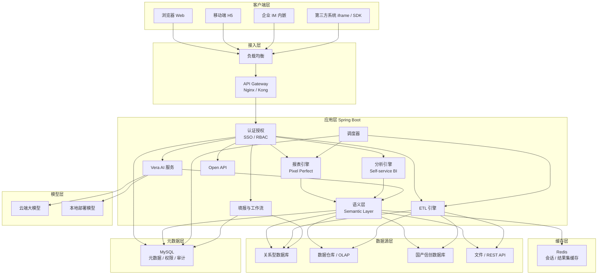

### 请求链路

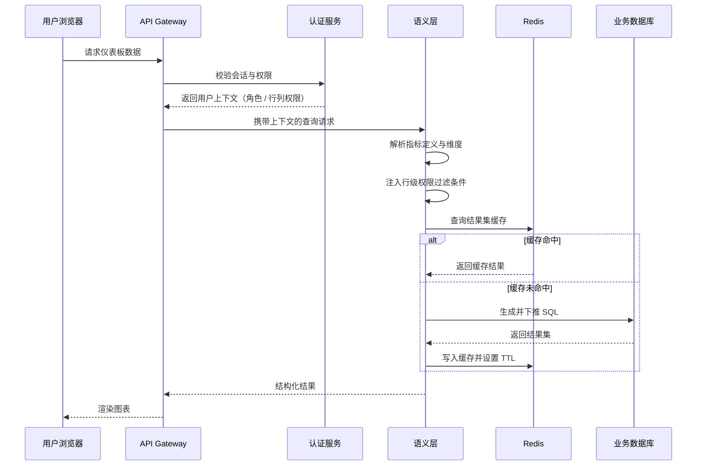

### 查询执行流程

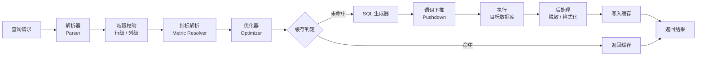

### 部署拓扑

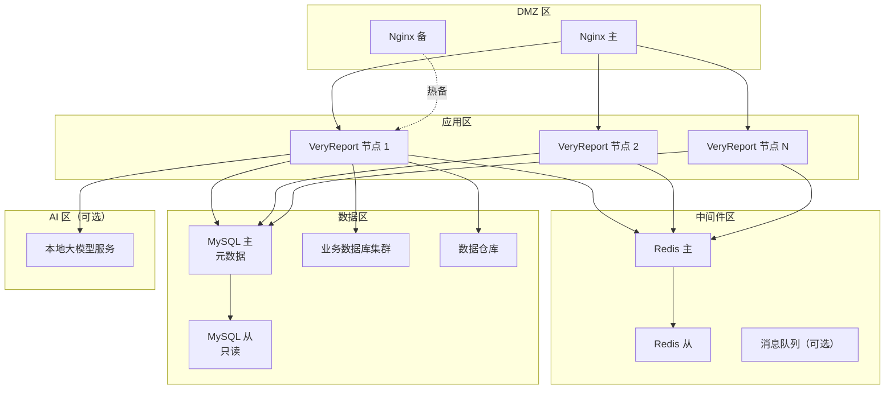

### 数据模型分层

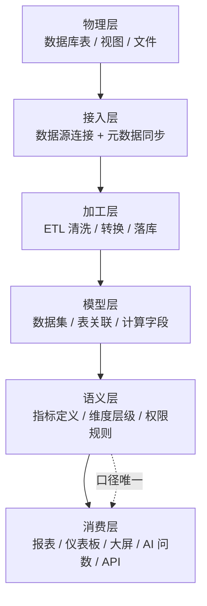

语义层是这套分层的关键。所有消费方——包括 AI——都只能通过语义层访问数据，不允许绕过它直接查询物理表。这样做的代价是灵活性受限，收益是**任何一个指标在任何一个消费场景中的口径必然一致**。

---

## 支持的数据源

平台内置 48 种数据源驱动，覆盖关系型数据库、信创数据库、数据仓库、大数据组件、NoSQL、文件与接口。未列出的数据服务可通过上传自定义 JDBC 驱动或注册 REST API 数据源接入。

### 关系型数据库

| # | 数据源 | 版本要求 | 直连查询 | ETL 读 | ETL 写 |
|---:|---|---|:---:|:---:|:---:|
| 1 | MySQL | 5.6 / 5.7 / 8.x | ✅ | ✅ | ✅ |
| 2 | Oracle | 11g / 12c / 19c / 21c | ✅ | ✅ | ✅ |
| 3 | PostgreSQL | 10+ | ✅ | ✅ | ✅ |
| 4 | Microsoft SQL Server | 2012+ | ✅ | ✅ | ✅ |
| 5 | MariaDB | 10.3+ | ✅ | ✅ | ✅ |
| 6 | IBM DB2 | 10.5+ | ✅ | ✅ | ✅ |
| 7 | SQLite | 3.x | ✅ | ✅ | ✅ |
| 8 | H2 | 1.4+ | ✅ | ✅ | ✅ |
| 9 | Sybase ASE | 15+ | ✅ | ✅ | 🔶 |
| 10 | Informix | 12+ | ✅ | ✅ | 🔶 |
| 11 | TiDB | 5.0+ | ✅ | ✅ | ✅ |
| 12 | PolarDB | MySQL / PG 兼容版 | ✅ | ✅ | ✅ |

### 国产与信创数据库

信创环境是平台的重点适配方向，以下数据源均在国产操作系统与 CPU 架构上完成验证。

| # | 数据源 | 说明 | 直连查询 | ETL 读 | ETL 写 |
|---:|---|---|:---:|:---:|:---:|
| 13 | 达梦 DM | DM7 / DM8 | ✅ | ✅ | ✅ |
| 14 | 人大金仓 KingbaseES | V8+ | ✅ | ✅ | ✅ |
| 15 | openGauss | 2.0+ | ✅ | ✅ | ✅ |
| 16 | GaussDB | 华为云数据库 | ✅ | ✅ | ✅ |
| 17 | OceanBase | MySQL / Oracle 模式 | ✅ | ✅ | ✅ |
| 18 | TDSQL | 腾讯分布式数据库 | ✅ | ✅ | ✅ |
| 19 | GBase 8a / 8s | 南大通用 | ✅ | ✅ | ✅ |
| 20 | 神通数据库 ShenTong | V7+ | ✅ | ✅ | 🔶 |
| 21 | 瀚高 HighGo | V4+ | ✅ | ✅ | ✅ |
| 22 | 星环 Inceptor | TDH | ✅ | ✅ | 🔶 |
| 23 | 巨杉 SequoiaDB | 3.x | ✅ | ✅ | 🔶 |
| 24 | 优炫 UXDB | V1+ | ✅ | ✅ | 🔶 |

### 数据仓库与 OLAP

| # | 数据源 | 说明 | 直连查询 | ETL 读 | ETL 写 |
|---:|---|---|:---:|:---:|:---:|
| 25 | ClickHouse | 列式 OLAP，适合大宽表聚合 | ✅ | ✅ | ✅ |
| 26 | Apache Doris | MPP 分析型数据库 | ✅ | ✅ | ✅ |
| 27 | StarRocks | 向量化查询引擎 | ✅ | ✅ | ✅ |
| 28 | Apache Kylin | 预计算多维立方体 | ✅ | ✅ | ➖ |
| 29 | Greenplum | MPP 数据仓库 | ✅ | ✅ | ✅ |
| 30 | Vertica | 列式分析数据库 | ✅ | ✅ | 🔶 |
| 31 | Teradata | 企业级数仓 | ✅ | ✅ | 🔶 |
| 32 | Snowflake | 云数据仓库 | ✅ | ✅ | 🔶 |
| 33 | Amazon Redshift | AWS 数据仓库 | ✅ | ✅ | 🔶 |
| 34 | Google BigQuery | GCP 数据仓库 | ✅ | ✅ | ➖ |
| 35 | 阿里云 MaxCompute | 大数据计算服务 | ✅ | ✅ | 🔶 |
| 36 | 阿里云 AnalyticDB | 实时数仓 | ✅ | ✅ | ✅ |

### 大数据与湖仓

| # | 数据源 | 说明 | 直连查询 | ETL 读 | ETL 写 |
|---:|---|---|:---:|:---:|:---:|
| 37 | Apache Hive | 通过 HiveServer2 连接 | ✅ | ✅ | ✅ |
| 38 | Apache Spark SQL | Thrift Server | ✅ | ✅ | ✅ |
| 39 | Presto / Trino | 联邦查询引擎 | ✅ | ✅ | 🔶 |
| 40 | Apache Impala | 交互式查询 | ✅ | ✅ | 🔶 |
| 41 | Apache HBase | 通过 Phoenix 访问 | ✅ | ✅ | 🔶 |
| 42 | Apache Iceberg | 表格式，需配合查询引擎 | 🔶 | ✅ | 🗓️ |
| 43 | Apache Hudi | 表格式，需配合查询引擎 | 🔶 | ✅ | 🗓️ |
| 44 | Apache Kafka | 流数据接入 ETL | ➖ | ✅ | ✅ |

### NoSQL 与检索引擎

| # | 数据源 | 说明 | 直连查询 | ETL 读 | ETL 写 |
|---:|---|---|:---:|:---:|:---:|
| 45 | MongoDB | 文档数据库，支持聚合管道 | ✅ | ✅ | ✅ |
| 46 | Elasticsearch | 通过 SQL 接口或 DSL 查询 | ✅ | ✅ | ✅ |
| 47 | Redis | 作为维表或缓存数据源 | 🔶 | ✅ | ✅ |
| 48 | InfluxDB | 时序数据库 | ✅ | ✅ | 🔶 |

### 文件与接口

| # | 数据源 | 说明 |
|---:|---|---|
| 49 | Excel（xls / xlsx） | 支持多 Sheet、指定表头行 |
| 50 | CSV / TSV | 支持自定义分隔符与编码 |
| 51 | JSON | 支持嵌套结构展平 |
| 52 | XML | 按 XPath 提取节点 |
| 53 | Parquet | 列式文件格式 |
| 54 | REST API | GET / POST，支持鉴权头与分页参数 |
| 55 | GraphQL | 注册查询语句为数据源 |
| 56 | SOAP WebService | 传统企业接口 |
| 57 | FTP / SFTP | 定时拉取远端文件 |
| 58 | 对象存储 | S3、OSS、MinIO、COS |

### 数据源能力矩阵

不同数据源在功能支持上存在差异，主要取决于其自身能力。

| 能力 | 关系型数据库 | OLAP / 数仓 | 大数据组件 | NoSQL | 文件 | REST API |
|---|:---:|:---:|:---:|:---:|:---:|:---:|
| 直连实时查询 | ✅ | ✅ | ✅ | 🔶 | ➖ | ✅ |
| 谓词下推 | ✅ | ✅ | ✅ | 🔶 | ➖ | ➖ |
| 聚合下推 | ✅ | ✅ | ✅ | 🔶 | ➖ | ➖ |
| 多表关联 | ✅ | ✅ | ✅ | 🔶 | ✅ | 🔶 |
| 行级权限注入 | ✅ | ✅ | ✅ | 🔶 | ✅ | 🔶 |
| 增量抽取 | ✅ | ✅ | ✅ | ✅ | 🔶 | 🔶 |
| ETL 写回 | ✅ | ✅ | 🔶 | ✅ | ✅ | 🔶 |
| 填报直写 | ✅ | 🔶 | ➖ | ✅ | ➖ | ➖ |
| 元数据自动同步 | ✅ | ✅ | ✅ | 🔶 | ✅ | ➖ |

> 关于性能的说明：VeryReport 本身不是计算引擎，聚合与关联运算尽可能下推到数据源执行。查询性能主要由底层数据库或数仓的能力决定。对于大数据量分析场景，建议将明细数据经 ETL 加工到 ClickHouse、Doris 或 StarRocks 这类分析型数据库后再接入。

---

## AI 能力详解

VeryReport 的 AI 能力以 **Vera** 命名。它的设计前提与许多「AI + BI」产品不同：**不追求让模型直接理解数据库，而是让模型在语义层提供的受控范围内工作。**

### Chat BI 与自然语言问数

用户以自然语言提问，平台返回数据、图表以及本次查询使用的指标口径。

```text
用户：上个季度华东区各产品线的毛利率，按毛利率从高到低排

Vera：
  使用指标：毛利率（销售利润 / 销售收入，口径归属月）
  维度：产品线 · 时间范围：2026-04-01 至 2026-06-30
  权限过滤：区域 = 华东（依据当前用户的数据权限自动注入）

  产品线      销售收入      销售利润     毛利率
  工业设备    ¥12,847,300   ¥4,238,600   33.0%
  智能仪表    ¥8,192,400    ¥2,376,800   29.0%
  配件耗材    ¥3,458,900    ¥864,700     25.0%

  [ 查看生成的 SQL ]  [ 转为仪表板 ]  [ 导出 Excel ]
```

关键点在于 Vera 返回的不只是数字，还包括**它用了哪个指标定义、套用了什么权限过滤**。这让业务人员可以判断这个答案是否回答了他真正的问题。

### AI SQL

对于熟悉 SQL 的用户，Vera 可以作为 SQL 助手使用。

| 能力 | 说明 |
|---|---|
| 自然语言转 SQL | 基于已同步的元数据与语义定义生成查询 |
| SQL 解释 | 将现有 SQL 翻译为业务语言描述 |
| SQL 优化建议 | 指出缺失索引、全表扫描、笛卡尔积等问题 |
| 方言转换 | 在 MySQL、Oracle、PostgreSQL 等方言间转换 |
| 错误诊断 | 根据数据库报错给出修复建议 |

生成的 SQL 始终展示给用户，不做隐藏执行。用户可以修改后再运行。

### AI Dashboard

输入一句业务描述，生成包含多个图表的仪表板草稿。

```text
输入：做一个销售经营月报看板，要有收入趋势、区域对比、TOP10 客户和目标完成率

生成：
  ├── KPI 卡  ×4    本月收入 / 同比 / 环比 / 目标完成率
  ├── 折线图  ×1    近 13 个月收入趋势
  ├── 柱状图  ×1    各区域收入对比（支持下钻到省份）
  ├── 条形图  ×1    TOP10 客户收入排行
  ├── 仪表图  ×1    年度目标完成进度
  └── 明细表  ×1    可下钻的订单明细

  已自动配置：全局时间筛选器、区域联动、行级权限继承
```

生成结果是**可编辑的草稿**而非最终产物。设计意图是把搭建看板中最机械的部分（布局、字段绑定、筛选器配置）自动化，把判断留给人。

### AI Insight

对已有的图表或数据集自动生成分析结论。

| 分析类型 | 说明 |
|---|---|
| 趋势识别 | 识别上升、下降、周期性与拐点 |
| 异常检测 | 基于历史分布标记离群值 |
| 归因分析 | 拆解指标变动的主要贡献维度 |
| 对比分析 | 同比、环比、与目标对比的自动解读 |
| 相关性提示 | 提示可能相关的其他指标 |
| 结论摘要 | 输出可直接用于汇报的文字总结 |

### 语义层与口径治理

这是 Vera 准确率的核心依赖。自然语言问数失败的常见原因并不是模型不够强，而是模型不知道企业内部术语的确切含义——「有效订单」是否包含退货、「本月」按下单日期还是回款日期、「销售额」是否含税。

VeryReport 要求这些定义在语义层显式声明：

```yaml
# 语义层指标定义示例
metric:
  name: 有效订单数
  code: valid_order_count
  owner: 销售运营部
  description: 已支付且未在 7 天内退货的订单数量
  expression: COUNT(DISTINCT order_id)
  filters:
    - pay_status = 'PAID'
    - refund_flag = 0
  time_dimension: pay_date        # 明确时间归属口径
  synonyms:                       # 供 AI 匹配的业务别名
    - 有效单量
    - 成交订单数
    - 实际订单数
  related_dimensions:
    - region
    - product_line
    - sales_channel
  version: v3
  updated_at: 2026-06-18
```

声明 `synonyms` 之后，用户问「上月成交订单数」时，Vera 能确定映射到 `valid_order_count`，而不是猜测某张表的某个字段。

### LLM 接入与模型管理

| 接入方式 | 说明 |
|---|---|
| OpenAI 兼容协议 | 任何提供 OpenAI 格式接口的服务均可接入 |
| BYOK 自带密钥 | 使用企业自有的 API Key，调用记录归企业所有 |
| 本地模型服务 | 对接内网部署的 vLLM、Ollama、Xinference 等 |
| 国产模型 | 支持接入符合 OpenAI 协议的国内模型服务 |
| 多模型路由 | 按任务类型分配不同模型（如问数用强模型、摘要用轻模型） |
| 降级策略 | 主模型不可用时自动切换备用模型 |
| 调用配额 | 按用户或租户设置调用上限 |
| 脱敏传输 | 发送给模型前对敏感字段脱敏 |

对于要求数据完全不出内网的场景，可将模型服务部署在企业内部，AI 链路全程闭环。

```yaml
# 模型配置示例
llm:
  providers:
    - name: local-qwen
      type: openai-compatible
      base_url: http://10.0.12.31:8000/v1
      model: qwen2.5-32b-instruct
      timeout: 60s
      usage: [nl2sql, insight]

    - name: local-small
      type: openai-compatible
      base_url: http://10.0.12.31:8000/v1
      model: qwen2.5-7b-instruct
      timeout: 30s
      usage: [summary, title-generation]

  routing:
    default: local-qwen
    fallback: local-small

  privacy:
    mask_sensitive_fields: true
    send_sample_rows: false      # 只发送 schema 与语义定义，不发送数据行
    log_prompts: true
```

其中 `send_sample_rows: false` 是一个常用的合规配置——只把表结构与指标定义发给模型，不发送任何真实数据行。

### MCP 与 Tool Calling

VeryReport 可以作为 **MCP（Model Context Protocol）Server** 运行，把平台的数据查询能力暴露为标准工具，供外部 AI 应用调用。

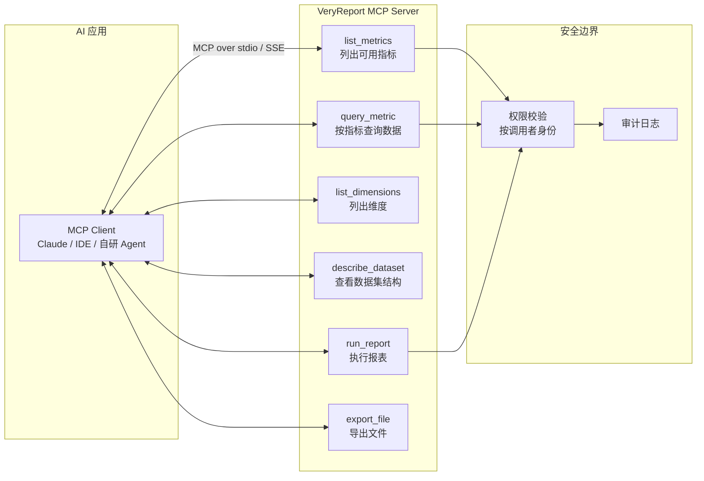

MCP 工具的调用同样受权限约束——外部 Agent 以某个用户身份调用时，只能拿到该用户有权查看的数据。

内置的 Tool Calling 工具清单：

| 工具 | 功能 | 权限要求 |
|---|---|---|
| `list_metrics` | 列出当前用户可访问的指标 | 指标读权限 |
| `query_metric` | 按指标 + 维度 + 时间范围查询 | 数据集读权限 |
| `list_dimensions` | 列出指标可用的分析维度 | 指标读权限 |
| `describe_dataset` | 返回数据集字段与类型 | 数据集读权限 |
| `run_report` | 执行指定报表并返回结果 | 报表执行权限 |
| `create_dashboard` | 创建仪表板 | 仪表板写权限 |
| `export_file` | 导出 Excel / PDF | 导出权限 |
| `search_resource` | 搜索报表与仪表板 | 资源读权限 |

### Agent 编排

面向多步分析任务，Vera 支持将复杂问题拆解为可执行的步骤序列。

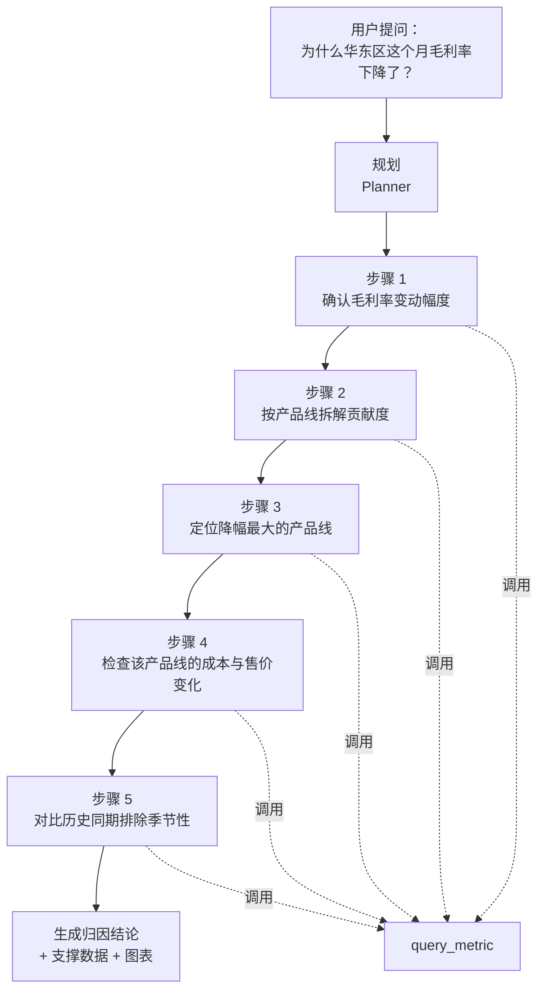

每一步的查询都会记录在执行轨迹中，用户可以逐步检查 Agent 的推理路径与所用数据，而不是只看到一个结论。

### RAG 知识增强

将企业内部的业务文档纳入检索范围，用于回答定义类与流程类问题。

| 知识来源 | 用途 |
|---|---|
| 指标字典 | 回答「XX 指标怎么算的」 |
| 业务流程文档 | 回答「订单状态流转规则是什么」 |
| 报表说明文档 | 回答「这张报表的数据从哪来」 |
| 历史问答记录 | 复用已确认过的口径解释 |
| 数据字典 | 回答字段含义与取值范围 |

### AI 可审计性

对企业客户而言，AI 给出的数字能否被审计比它是否聪明更重要。平台在这方面的设计：

- [x] 每次问数记录完整的**执行轨迹**：原始提问、匹配到的指标、生成的 SQL、返回行数、耗时
- [x] 生成的 SQL **始终对用户可见**，不做隐藏执行
- [x] AI 查询受**同一套行列级权限**约束，不存在提权通道
- [x] 语义层限定了 AI 的**可查询范围**，无法访问未注册的物理表
- [x] 模型调用记录写入审计日志，包括使用的模型与 token 消耗
- [x] 支持配置**不向模型发送真实数据行**，仅发送 schema 与语义定义
- [x] 对同一问题的重复提问返回**一致结果**（基于指标定义而非模型即时推断）

---

## 仪表板与可视化

### 仪表板

仪表板是自助分析的主要交付形态，面向经营监控与日常决策。

| 特性 | 说明 |
|---|---|
| 网格布局 | 自由拖拽组件位置与尺寸，支持吸附对齐 |
| 全局筛选器 | 时间、区域、组织等筛选条件作用于整个看板 |
| 图表联动 | 点击某图表的数据点，其他图表同步筛选 |
| 多层钻取 | 从汇总逐级下钻到明细，路径可返回 |
| Tab 分页 | 一个仪表板内组织多个分析主题 |
| 条件显隐 | 按用户角色或数据条件动态显示组件 |
| 刷新策略 | 手动、定时或数据变更触发 |
| 快照订阅 | 定时生成快照推送到邮箱或 IM |

### KPI 指标卡

指标卡是管理层最常关注的组件，支持完整的对比语义。

| 能力 | 说明 |
|---|---|
| 主指标值 | 当前周期数值，支持单位与精度配置 |
| 同比 / 环比 | 自动计算并标注涨跌方向 |
| 目标完成度 | 与目标值对比，展示完成百分比 |
| 迷你趋势图 | 卡片内嵌 Sparkline |
| 阈值着色 | 按区间自动变色（达标 / 预警 / 超限） |
| 下钻入口 | 点击卡片进入明细分析 |

### 图表类型

| 分类 | 图表 |
|---|---|
| 趋势 | 折线图、面积图、堆叠面积图、阶梯图 |
| 对比 | 柱状图、条形图、堆叠柱状图、百分比堆叠、瀑布图 |
| 构成 | 饼图、环形图、玫瑰图、旭日图、矩形树图 |
| 分布 | 散点图、气泡图、箱线图、直方图、热力图 |
| 关系 | 桑基图、和弦图、关系网络图、漏斗图 |
| 进度 | 仪表盘、水波图、进度条、子弹图 |
| 层级 | 树图、组织架构图、思维导图 |
| 表格 | 明细表、汇总表、交叉表、指标看板表 |
| 组合 | 双轴图、柱线组合、多度量组合 |
| 特殊 | 词云、日历热图、雷达图、K 线图、甘特图 |

### 地图可视化

| 能力 | 说明 |
|---|---|
| 行政区划地图 | 全国、省、市、区县四级下钻 |
| 自定义地图 | 上传 GeoJSON 支持园区、楼层、门店平面图 |
| 散点地图 | 按经纬度打点，支持聚合 |
| 热力地图 | 密度分布可视化 |
| 飞线地图 | 展示流向关系（物流、资金、人流） |
| 轨迹地图 | 按时间序列播放移动路径 |
| 区域着色 | 按指标值渐变填色 |

### 数据大屏

大屏与仪表板的差异在于使用场景：大屏面向展示与监控，通常投放在固定分辨率的显示设备上。

| 能力 | 说明 |
|---|---|
| 画布式设计 | 按绝对坐标定位，精确控制视觉效果 |
| 分辨率预设 | 1920×1080、3840×2160、超宽屏与自定义 |
| 等比缩放 | 在不同尺寸屏幕上保持布局比例 |
| 实时刷新 | 最小 1 秒间隔轮询 |
| 动画与转场 | 组件入场动画、数字滚动、轮播切换 |
| 多屏拼接 | 电视墙场景下的多屏协同 |
| 免登录分享 | 生成公共链接，可设有效期与访问密码 |
| 场景轮播 | 多个大屏页面按时间自动切换 |

---

## 报表能力详解

报表引擎是 VeryReport 与多数 BI 产品的主要差异所在。这部分能力面向的是**格式确定、需要打印或归档、通常有监管要求**的场景。

### Pixel Perfect 报表

「像素级精确」指的是设计稿与最终输出（屏幕、PDF、打印稿）在位置与尺寸上完全一致。这在财务报表、监管报送、票据打印场景中是硬性要求。

| 能力 | 说明 |
|---|---|
| 绝对定位 | 单元格行高列宽以精确数值设定 |
| 纸张适配 | A3、A4、A5、自定义尺寸与横纵向 |
| 页边距控制 | 上下左右边距精确到毫米 |
| 页眉页脚 | 支持页码、总页数、打印时间、公司标识 |
| 分页符 | 手动插入或按分组自动分页 |
| 打印预览 | 所见即所得，与实际输出一致 |

### 中国式复杂报表

「中国式报表」指的是一类在国内企业中普遍存在、但在国际报表工具中实现成本较高的表样特征。

| 特征 | 说明 |
|---|---|
| 多层表头 | 三层以上表头嵌套，含跨行跨列合并 |
| 斜线表头 | 单元格内对角线分隔的双维表头 |
| 不规则合并 | 同一表格内多处不规则单元格合并 |
| 多表体混排 | 一页内多个独立表格区域 |
| 纵向扩展与横向扩展并存 | 行列同时由数据驱动扩展 |
| 组内小计与合计 | 多级分组的层层小计 |
| 同一列多口径 | 同一列内不同行使用不同计算规则 |

一个典型的资产负债表样例结构：

```text
┌──────────────────────────────────────────────────────────────┐
│                      资产负债表                                │
│  编制单位：XXX 有限公司        2026 年 6 月 30 日      单位：元  │
├───────────────┬───────┬───────┬───────────────┬───────┬───────┤
│     资产      │ 期末  │ 年初  │  负债和所有者  │ 期末  │ 年初  │
│               │ 余额  │ 余额  │     权益      │ 余额  │ 余额  │
├───────────────┼───────┼───────┼───────────────┼───────┼───────┤
│ 流动资产：     │       │       │ 流动负债：     │       │       │
│   货币资金     │  ...  │  ...  │   短期借款     │  ...  │  ...  │
│   应收账款     │  ...  │  ...  │   应付账款     │  ...  │  ...  │
│   存货        │  ...  │  ...  │   预收账款     │  ...  │  ...  │
│ 流动资产合计   │  ...  │  ...  │ 流动负债合计   │  ...  │  ...  │
├───────────────┼───────┼───────┼───────────────┼───────┼───────┤
│ 资产总计      │  ...  │  ...  │ 负债及权益总计 │  ...  │  ...  │
└───────────────┴───────┴───────┴───────────────┴───────┴───────┘
   左右两个表体共享同一行高，且合计行必须对齐
```

这种「左右分栏、行高对齐、多级小计」的结构是报表引擎能力的典型检验点。

### 交叉报表

行列双向动态扩展，列数由数据决定。

```text
                    2026年1月   2026年2月   2026年3月   ...   合计
                    ↑ 列由数据动态扩展，月份增加时自动加列
  华东区
    上海            1,284,300   1,392,800   1,458,200        ...
    江苏              892,100     934,500     1,012,400      ...
    小计            2,176,400   2,327,300   2,470,600        ...
  华南区
    广东            1,542,900   1,628,300   1,703,800        ...
    ↑ 行由数据动态扩展
  合计              3,719,300   3,955,600   4,174,400        ...
```

### 分组报表

多级分组，每级可配置独立的小计规则与样式。

| 能力 | 说明 |
|---|---|
| 多级分组 | 支持任意层级嵌套 |
| 分组小计 | 每级分组末尾自动插入小计行 |
| 分组分页 | 每个分组从新页开始 |
| 分组排序 | 按分组字段或小计值排序 |
| 组头组尾 | 分组前后插入说明行 |
| 跨页重复表头 | 分页后自动重复表头与组头 |

### Excel 报表

| 方向 | 能力 |
|---|---|
| Excel 导入 | 上传 Excel 作为报表模板，保留原有样式 |
| Excel 导出 | 导出后保留合并单元格、样式、公式与冻结窗格 |
| 大数据量导出 | 流式写入，避免内存溢出 |
| 多 Sheet 导出 | 一个报表输出多个工作表 |
| 导出模板绑定 | 数据填入既有 Excel 模板的指定位置 |

### 报表函数

内置 200 余个函数，覆盖聚合、数学、文本、日期、逻辑与财务计算。

| 分类 | 示例函数 |
|---|---|
| 聚合 | `SUM` `AVG` `COUNT` `MAX` `MIN` `COUNTD` `MEDIAN` `STDEV` |
| 数学 | `ROUND` `CEILING` `FLOOR` `ABS` `MOD` `POWER` `SQRT` |
| 文本 | `CONCAT` `LEFT` `RIGHT` `MID` `LEN` `REPLACE` `TRIM` `SPLIT` |
| 日期 | `TODAY` `DATEDIF` `DATEADD` `YEAR` `MONTH` `WEEKDAY` `QUARTER` |
| 逻辑 | `IF` `IFS` `AND` `OR` `NOT` `CASE` `ISNULL` `COALESCE` |
| 查找 | `VLOOKUP` `LOOKUP` `INDEX` `MATCH` |
| 财务 | `PV` `FV` `NPV` `IRR` `PMT` `RATE` |
| 报表专用 | `SEQ`（序号）`GROUPSUM`（组内合计）`PARENT`（父级值）`RANK` |
| 中文专用 | `RMBUPPER`（金额大写）`CHINESENUM`（数字转中文） |

`RMBUPPER` 这类函数看起来不起眼，但在国内财务报表场景中几乎每张单据都要用到。

---

## ETL 与数据集成

ETL 模块的定位是**为分析准备数据**，不是替代企业级数据集成平台。它解决的是从业务库到分析库的常规加工需求。

### 流程编排

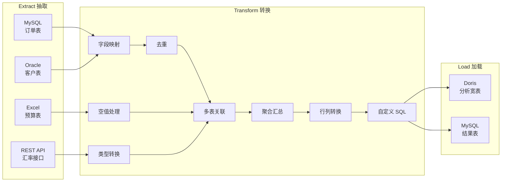

### 抽取（Extract）

| 能力 | 说明 |
|---|---|
| 全量抽取 | 每次同步完整数据 |
| 增量抽取 | 按时间戳、自增主键或版本号增量 |
| 分区抽取 | 按分区键并行读取 |
| 并行度控制 | 配置读取线程数与批次大小 |
| 断点续传 | 中断后从上次位置继续 |
| 抽取限流 | 控制读取速率，避免影响生产库 |

### 转换（Transform）

| 算子 | 说明 |
|---|---|
| 字段映射 | 重命名、调整顺序、选择输出字段 |
| 类型转换 | 字符串、数值、日期间转换 |
| 去重 | 按指定键去重，可保留最新或最早记录 |
| 过滤 | 按条件筛选行 |
| 空值处理 | 填充默认值、丢弃或标记 |
| 字符串处理 | 截取、拼接、替换、正则提取 |
| 日期处理 | 格式化、时区转换、周期计算 |
| 多表关联 | 各类 JOIN |
| 并集 | UNION 多个数据流 |
| 聚合 | 分组聚合与窗口函数 |
| 行列转换 | 宽表转长表、长表转宽表 |
| 拆分与合并 | 一列拆多列、多列合一列 |
| 数据质量校验 | 唯一性、非空、范围、正则校验 |
| 脱敏 | 手机号、身份证、银行卡遮蔽 |
| 自定义 SQL | 直接编写 SQL 完成复杂转换 |
| 自定义脚本 | 通过脚本算子处理特殊逻辑 |

### 加载（Load）

| 模式 | 说明 |
|---|---|
| 全量覆盖 | 清空目标表后写入 |
| 追加写入 | 直接 INSERT |
| 更新插入 | 按主键 UPSERT |
| 拉链表 | 记录历史变化（SCD Type 2） |
| 分批提交 | 按批次大小提交事务 |
| 写入前校验 | 数据量异常时中止写入 |

### 调度与依赖

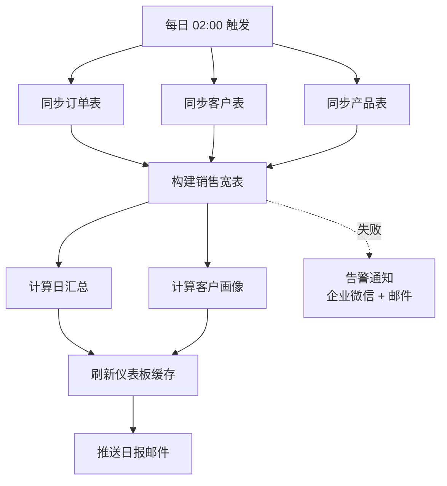

| 能力 | 说明 |
|---|---|
| Cron 调度 | 标准 Cron 表达式 |
| 依赖调度 | 上游成功后触发下游 |
| 并行执行 | 无依赖任务并行运行 |
| 失败重试 | 配置重试次数与间隔 |
| 超时中止 | 超过阈值自动终止 |
| 补数据 | 指定日期范围重跑历史 |
| 执行日志 | 每步耗时与处理行数 |
| 告警通知 | 失败时通知责任人 |

---

## 数据填报与工作流

数据填报解决的是「**数据还不在系统里**」的情况——预算编制、盘点上报、指标填写、跨单位数据收集。这类需求在国内企业中极为常见，通常用 Excel 加邮件完成，过程难以追溯。

### 在线表单

| 组件 | 说明 |
|---|---|
| 单行文本 / 多行文本 | 支持长度与正则校验 |
| 数字 | 精度、范围、千分位 |
| 下拉选择 | 静态选项或数据集动态加载 |
| 级联选择 | 省市区、组织架构等多级联动 |
| 日期与时间 | 单日期、日期区间 |
| 单选与多选 | 按钮组、复选框 |
| 文件上传 | 附件与图片，可限制类型与大小 |
| 明细表格 | 可增删行的子表 |
| 计算字段 | 由其他字段自动计算 |
| 说明文本 | 填报指引 |

### 填报报表

以报表样式录入数据，适合结构固定、字段较多的场景，用户体验接近 Excel。

| 能力 | 说明 |
|---|---|
| 批量粘贴 | 从 Excel 复制整块数据粘贴 |
| 公式联动 | 单元格间自动计算 |
| 行内校验 | 输入即时校验并提示 |
| 增删行 | 明细区动态增减 |
| 分片提交 | 大表分段保存，避免超时 |
| 暂存草稿 | 未完成先保存 |
| 导入导出 | Excel 模板导入与导出 |

### 审批工作流

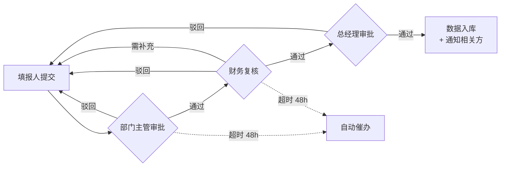

| 能力 | 说明 |
|---|---|
| 多级审批 | 串行或并行审批节点 |
| 条件分支 | 按金额或类型走不同审批路径 |
| 驳回与重提 | 驳回到指定节点 |
| 加签与转办 | 临时增加审批人或转交 |
| 会签 | 多人同时审批，全部通过才继续 |
| 超时催办 | 超时自动提醒或自动通过 |
| 审批意见 | 每个节点记录意见 |
| 流程留痕 | 完整审批历史可查 |
| 移动审批 | 手机端处理待办 |

### 任务管理

| 能力 | 说明 |
|---|---|
| 任务下发 | 按组织架构批量分派 |
| 填报周期 | 日报、周报、月报、季报、年报 |
| 截止时间 | 到期前提醒，逾期标记 |
| 进度看板 | 实时展示各单位提交状态 |
| 催办 | 一键通知未提交单位 |
| 数据锁定 | 截止后锁定，禁止修改 |
| 历史归档 | 按周期归档保存 |

---

## 部署方式

所有部署方式功能一致，不存在因部署形态导致的功能差异。

### Docker

单容器快速启动，适合评估与开发。

```bash
# 拉取镜像
docker pull veryreport/veryreport:latest

# 启动（使用内置嵌入式数据库，仅用于试用）
docker run -d \
  --name veryreport \
  -p 8080:8080 \
  -v /data/veryreport:/opt/veryreport/data \
  -e TZ=Asia/Shanghai \
  -e JAVA_OPTS="-Xms2g -Xmx4g" \
  veryreport/veryreport:latest

# 查看启动日志
docker logs -f veryreport

# 访问 http://localhost:8080
```

### Docker Compose

包含 MySQL 与 Redis 的完整环境，适合生产前验证。

```yaml
# docker-compose.yml
version: "3.8"

services:
  veryreport:
    image: veryreport/veryreport:latest
    container_name: veryreport
    ports:
      - "8080:8080"
    environment:
      TZ: Asia/Shanghai
      JAVA_OPTS: "-Xms4g -Xmx8g -XX:+UseG1GC"
      DB_TYPE: mysql
      DB_HOST: mysql
      DB_PORT: 3306
      DB_NAME: veryreport
      DB_USER: veryreport
      DB_PASSWORD: ${DB_PASSWORD}
      REDIS_HOST: redis
      REDIS_PORT: 6379
      REDIS_PASSWORD: ${REDIS_PASSWORD}
    volumes:
      - ./data:/opt/veryreport/data
      - ./logs:/opt/veryreport/logs
      - ./drivers:/opt/veryreport/drivers    # 自定义 JDBC 驱动
    depends_on:
      mysql:
        condition: service_healthy
      redis:
        condition: service_started
    restart: unless-stopped
    healthcheck:
      test: ["CMD", "curl", "-f", "http://localhost:8080/actuator/health"]
      interval: 30s
      timeout: 10s
      retries: 5
      start_period: 90s

  mysql:
    image: mysql:8.0
    container_name: veryreport-mysql
    environment:
      TZ: Asia/Shanghai
      MYSQL_ROOT_PASSWORD: ${MYSQL_ROOT_PASSWORD}
      MYSQL_DATABASE: veryreport
      MYSQL_USER: veryreport
      MYSQL_PASSWORD: ${DB_PASSWORD}
    command:
      - --character-set-server=utf8mb4
      - --collation-server=utf8mb4_unicode_ci
      - --max_connections=500
      - --innodb_buffer_pool_size=2G
    volumes:
      - ./mysql-data:/var/lib/mysql
    healthcheck:
      test: ["CMD", "mysqladmin", "ping", "-h", "localhost"]
      interval: 10s
      timeout: 5s
      retries: 10
    restart: unless-stopped

  redis:
    image: redis:7-alpine
    container_name: veryreport-redis
    command: redis-server --requirepass ${REDIS_PASSWORD} --maxmemory 2gb --maxmemory-policy allkeys-lru
    volumes:
      - ./redis-data:/data
    restart: unless-stopped
```

```bash
# 创建环境变量文件
cat > .env <<'EOF'
MYSQL_ROOT_PASSWORD=change-me-root
DB_PASSWORD=change-me-db
REDIS_PASSWORD=change-me-redis
EOF

# 启动
docker compose up -d

# 查看状态
docker compose ps

# 查看日志
docker compose logs -f veryreport
```

### Kubernetes

```yaml
# veryreport-deployment.yaml
apiVersion: apps/v1
kind: Deployment
metadata:
  name: veryreport
  namespace: bi
spec:
  replicas: 3
  selector:
    matchLabels:
      app: veryreport
  template:
    metadata:
      labels:
        app: veryreport
    spec:
      containers:
        - name: veryreport
          image: veryreport/veryreport:latest
          ports:
            - containerPort: 8080
              name: http
          env:
            - name: TZ
              value: Asia/Shanghai
            - name: JAVA_OPTS
              value: "-Xms4g -Xmx8g -XX:+UseG1GC -XX:MaxRAMPercentage=75"
            - name: DB_HOST
              value: mysql.bi.svc.cluster.local
            - name: DB_PASSWORD
              valueFrom:
                secretKeyRef:
                  name: veryreport-secret
                  key: db-password
            - name: REDIS_HOST
              value: redis.bi.svc.cluster.local
            - name: CLUSTER_ENABLED
              value: "true"
          resources:
            requests:
              cpu: "2"
              memory: 4Gi
            limits:
              cpu: "4"
              memory: 8Gi
          livenessProbe:
            httpGet:
              path: /actuator/health/liveness
              port: 8080
            initialDelaySeconds: 120
            periodSeconds: 30
          readinessProbe:
            httpGet:
              path: /actuator/health/readiness
              port: 8080
            initialDelaySeconds: 60
            periodSeconds: 10
          volumeMounts:
            - name: data
              mountPath: /opt/veryreport/data
      volumes:
        - name: data
          persistentVolumeClaim:
            claimName: veryreport-pvc
---
apiVersion: v1
kind: Service
metadata:
  name: veryreport
  namespace: bi
spec:
  selector:
    app: veryreport
  ports:
    - port: 80
      targetPort: 8080
  type: ClusterIP
---
apiVersion: networking.k8s.io/v1
kind: Ingress
metadata:
  name: veryreport
  namespace: bi
  annotations:
    nginx.ingress.kubernetes.io/proxy-body-size: "100m"
    nginx.ingress.kubernetes.io/proxy-read-timeout: "600"
spec:
  rules:
    - host: bi.example.com
      http:
        paths:
          - path: /
            pathType: Prefix
            backend:
              service:
                name: veryreport
                port:
                  number: 80
```

```bash
kubectl create namespace bi
kubectl -n bi create secret generic veryreport-secret --from-literal=db-password='change-me'
kubectl apply -f veryreport-deployment.yaml
kubectl -n bi rollout status deployment/veryreport
```

### Helm

```bash
# 添加仓库
helm repo add veryreport https://www.veryreport.com
helm repo update

# 查看可配置项
helm show values veryreport/veryreport > values.yaml

# 安装
helm install veryreport veryreport/veryreport \
  --namespace bi \
  --create-namespace \
  --set replicaCount=3 \
  --set image.tag=latest \
  --set mysql.enabled=true \
  --set redis.enabled=true \
  --set ingress.enabled=true \
  --set ingress.hosts[0].host=bi.example.com \
  --set persistence.size=100Gi

# 升级
helm upgrade veryreport veryreport/veryreport -n bi -f values.yaml

# 回滚
helm rollback veryreport -n bi
```

### Linux 安装包

```bash
# 下载并解压
wget https://www.veryreport.com/download/veryreport-linux-x64.tar.gz
tar -zxvf veryreport-linux-x64.tar.gz -C /opt
cd /opt/veryreport

# 配置数据库连接
vi conf/application.yml

# 初始化元数据库
./bin/init-db.sh

# 启动
./bin/start.sh

# 查看状态
./bin/status.sh

# 停止
./bin/stop.sh

# 注册为 systemd 服务
sudo ./bin/install-service.sh
sudo systemctl enable veryreport
sudo systemctl start veryreport
sudo systemctl status veryreport
```

### Windows 安装包

```powershell
# 图形化安装
# 1. 下载 veryreport-setup-win-x64.exe
# 2. 双击运行，按向导选择安装目录与端口
# 3. 安装程序会自动注册 Windows 服务

# 命令行管理
cd C:\Program Files\VeryReport\bin
.\start.bat            # 启动
.\stop.bat             # 停止
.\install-service.bat  # 注册服务

# 服务管理
Get-Service VeryReport
Start-Service VeryReport
Stop-Service VeryReport
```

### macOS 本地开发

```bash
# Homebrew 安装（仅用于本地开发）
brew tap veryreport/tap
brew install veryreport

# 启动
brew services start veryreport

# 或从源码运行
git clone https://www.veryreport.com/veryreport.git
cd veryreport
./mvnw clean package -DskipTests
java -jar target/veryreport.jar --spring.profiles.active=dev
```

### 私有云与公有云

| 环境 | 说明 |
|---|---|
| VMware vSphere | 提供 OVA 模板 |
| OpenStack | 提供 QCOW2 镜像 |
| 阿里云 | ECS 部署或容器服务 ACK |
| 腾讯云 | CVM 部署或容器服务 TKE |
| 华为云 | ECS 部署或 CCE，适配 GaussDB |
| AWS | EC2 或 EKS |
| Azure | VM 或 AKS |
| 混合云 | 应用部署在私有云，数据源可跨云访问 |

### 信创环境

| 层次 | 支持范围 |
|---|---|
| CPU 架构 | 飞腾（ARM）、鲲鹏（ARM）、龙芯（LoongArch）、海光（x86）、兆芯（x86）、申威 |
| 操作系统 | 银河麒麟 V10、中标麒麟、统信 UOS、openEuler、Anolis OS、深度 Deepin |
| 数据库 | 达梦、人大金仓、openGauss、GaussDB、OceanBase、GBase、神通 |
| 中间件 | 东方通 TongWeb、宝兰德 BES、金蝶 Apusic |
| 运行时 | 毕昇 JDK、龙芯 JDK、OpenJDK（ARM / LoongArch 版） |
| 浏览器 | 奇安信浏览器、360 安全浏览器、红莲花浏览器 |

```bash
# 麒麟 V10 + 飞腾 ARM64 部署示例
# 确认架构
uname -m        # 期望输出 aarch64

# 安装毕昇 JDK
yum install -y bisheng-jdk-17

# 下载 ARM64 版本
wget https://www.veryreport.com/download/veryreport-linux-arm64.tar.gz
tar -zxvf veryreport-linux-arm64.tar.gz -C /opt

# 配置达梦数据库连接
cd /opt/veryreport
vi conf/application.yml
# database:
#   type: dm
#   url: jdbc:dm://192.168.1.100:5236/VERYREPORT
#   driver: dm.jdbc.driver.DmDriver

./bin/init-db.sh
./bin/start.sh
```

### 高可用部署

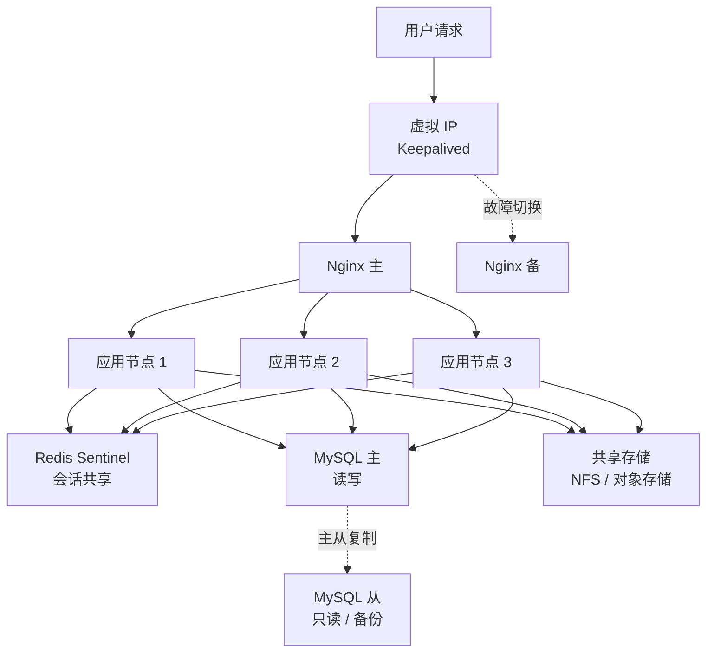

高可用部署的要点：

- [x] 会话通过 Redis 共享，任意节点可处理任意请求
- [x] 上传文件与导出结果存放在共享存储，不依赖本地磁盘
- [x] 调度任务通过分布式锁保证只在一个节点执行
- [x] 元数据库主从复制，从库用于备份与只读查询
- [x] 应用节点无状态，可随时扩缩容
- [x] 支持滚动升级，逐节点替换不中断服务

---

## 快速开始

本节以 Docker 部署 + MySQL 数据源为例，完成从安装到产出第一张仪表板和第一张报表的全过程。预计耗时 20 分钟。

### 环境要求

| 项目 | 最低配置 | 推荐配置 |
|---|---|---|
| CPU | 4 核 | 8 核及以上 |
| 内存 | 8 GB | 16 GB 及以上 |
| 磁盘 | 50 GB | 200 GB SSD |
| 操作系统 | Linux / Windows Server / macOS | Linux（CentOS 7+、Ubuntu 20.04+、麒麟 V10） |
| JDK | 17 | 17 |
| 元数据库 | MySQL 8.0 | MySQL 8.0 主从 |
| 缓存 | Redis 6 | Redis 7 哨兵模式 |
| 浏览器 | Chrome 90+、Edge 90+ | 最新版本 |

### 第一步 下载与安装

```bash
# 创建工作目录
mkdir -p ~/veryreport && cd ~/veryreport

# 下载 Compose 配置
curl -O https://www.veryreport.com/download/docker-compose.yml

# 生成密码配置
cat > .env <<'EOF'
MYSQL_ROOT_PASSWORD=Root@2026
DB_PASSWORD=Very@2026
REDIS_PASSWORD=Redis@2026
EOF

chmod 600 .env
```

### 第二步 启动服务

```bash
# 启动全部组件
docker compose up -d

# 等待初始化完成（首次启动需要 1-2 分钟建表）
docker compose logs -f veryreport | grep -m1 "Started VeryReportApplication"

# 确认健康状态
curl -s http://localhost:8080/actuator/health
# {"status":"UP"}
```

启动完成后访问 `http://localhost:8080`，使用初始账号登录：

| 项目 | 值 |
|---|---|
| 用户名 | `admin` |
| 初始密码 | 首次启动时输出在日志中，检索 `Initial admin password` |
| 首次登录 | 强制修改密码 |

```bash
# 获取初始密码
docker compose logs veryreport | grep "Initial admin password"
```

### 第三步 连接 MySQL

准备一个演示数据库：

```sql
-- 在业务 MySQL 中执行
CREATE DATABASE IF NOT EXISTS demo_sales
  DEFAULT CHARACTER SET utf8mb4;

USE demo_sales;

CREATE TABLE dim_region (
  region_id    INT PRIMARY KEY,
  region_name  VARCHAR(50) NOT NULL COMMENT '大区名称',
  province     VARCHAR(50) NOT NULL COMMENT '省份'
) COMMENT '区域维度表';

CREATE TABLE dim_product (
  product_id    INT PRIMARY KEY,
  product_name  VARCHAR(100) NOT NULL COMMENT '产品名称',
  product_line  VARCHAR(50)  NOT NULL COMMENT '产品线',
  unit_cost     DECIMAL(12,2) COMMENT '单位成本'
) COMMENT '产品维度表';

CREATE TABLE fact_order (
  order_id     BIGINT PRIMARY KEY,
  order_date   DATE NOT NULL COMMENT '下单日期',
  pay_date     DATE COMMENT '支付日期',
  region_id    INT NOT NULL COMMENT '区域',
  product_id   INT NOT NULL COMMENT '产品',
  customer_id  BIGINT COMMENT '客户',
  quantity     INT NOT NULL COMMENT '数量',
  amount       DECIMAL(14,2) NOT NULL COMMENT '销售金额',
  pay_status   VARCHAR(20) NOT NULL COMMENT '支付状态',
  refund_flag  TINYINT DEFAULT 0 COMMENT '退货标记',
  INDEX idx_order_date (order_date),
  INDEX idx_pay_date (pay_date),
  INDEX idx_region (region_id)
) COMMENT '订单事实表';
```

在 VeryReport 中添加数据源：

```text
左侧菜单 → 数据准备 → 数据源 → 新建数据源 → MySQL

  数据源名称：销售业务库
  主机地址：  192.168.1.50
  端口：      3306
  数据库：    demo_sales
  用户名：    readonly_user
  密码：      ********
  连接参数：  useUnicode=true&characterEncoding=utf8&serverTimezone=Asia/Shanghai

  [ 测试连接 ]  →  连接成功
  [ 保存 ]
```

> 生产环境建议为 VeryReport 单独创建只读数据库账号，仅授予所需库表的 `SELECT` 权限。填报功能需要写权限的表可单独授权。

```sql
-- 推荐的最小权限配置
CREATE USER 'veryreport_ro'@'%' IDENTIFIED BY 'StrongPassword';
GRANT SELECT ON demo_sales.* TO 'veryreport_ro'@'%';
FLUSH PRIVILEGES;
```

### 第四步 创建数据集

数据集是分析的基础单元。这里创建一个关联三张表的销售明细数据集。

```text
数据准备 → 数据集 → 新建数据集 → 可视化建模

  1. 从左侧拖入 fact_order 作为主表
  2. 拖入 dim_region，自动识别关联字段 region_id，选择 LEFT JOIN
  3. 拖入 dim_product，关联字段 product_id，选择 LEFT JOIN
  4. 在字段列表中：
       - 取消勾选不需要的字段（如 customer_id）
       - 将 amount 标记为「度量」
       - 将 order_date 标记为「日期维度」，设置层级：年 / 季 / 月 / 日
  5. 新增计算字段：
       字段名：销售成本
       表达式：quantity * unit_cost

       字段名：销售利润
       表达式：amount - quantity * unit_cost
  6. 保存为「销售明细」
```

也可以直接用 SQL 定义数据集：

```sql
-- SQL 数据集：销售明细
SELECT
    o.order_id,
    o.order_date,
    o.pay_date,
    r.region_name,
    r.province,
    p.product_name,
    p.product_line,
    o.quantity,
    o.amount,
    o.quantity * p.unit_cost                      AS sales_cost,
    o.amount - o.quantity * p.unit_cost           AS sales_profit,
    o.pay_status,
    o.refund_flag
FROM fact_order o
LEFT JOIN dim_region  r ON o.region_id  = r.region_id
LEFT JOIN dim_product p ON o.product_id = p.product_id
WHERE o.order_date >= ${start_date}          -- 参数化
  AND o.order_date <= ${end_date}
```

接着在语义层注册指标：

```text
数据准备 → 指标管理 → 新建指标

  指标名称：销售收入
  指标编码：sales_revenue
  所属数据集：销售明细
  聚合方式：SUM(amount)
  过滤条件：pay_status = 'PAID' AND refund_flag = 0
  时间口径：pay_date
  业务别名：营收、收入、销售额、成交金额
  负责人：  销售运营部
  单位：    元

  [ 保存并发布 ]
```

注册指标这一步容易被跳过，但它决定了后续所有报表、看板与 AI 问数的口径是否一致。**建议在项目初期就把核心指标定义清楚。**

### 第五步 创建仪表板

```text
分析 → 仪表板 → 新建仪表板

  1. 添加 KPI 卡
       指标：销售收入
       对比：同比、环比
       目标：从「年度目标」数据集读取

  2. 添加折线图
       X 轴：pay_date（按月）
       Y 轴：销售收入
       系列：product_line

  3. 添加柱状图
       X 轴：region_name
       Y 轴：销售收入
       启用下钻：region_name → province

  4. 添加条形图
       维度：product_name
       度量：销售收入
       排序：降序，取 TOP 10

  5. 添加全局筛选器
       字段：pay_date，控件类型：日期区间，默认值：本年至今
       字段：region_name，控件类型：多选下拉

  6. 配置联动
       点击柱状图的区域 → 折线图与条形图同步筛选

  7. 保存并发布
```

### 第六步 生成报表

```text
报表 → 新建报表 → 空白报表

  1. 在右侧数据面板绑定「销售明细」数据集

  2. 设计表头（A1:F2 区域）
       A1:A2 合并 → 输入「区域」
       B1:B2 合并 → 输入「产品线」
       C1:F1 合并 → 输入「销售情况」
       C2 → 数量   D2 → 销售金额   E2 → 销售成本   F2 → 销售利润

  3. 设计数据区（第 3 行）
       A3 → 绑定 region_name，扩展方向：纵向
       B3 → 绑定 product_line，扩展方向：纵向
       C3 → =SUM(quantity)
       D3 → =SUM(amount)
       E3 → =SUM(sales_cost)
       F3 → =D3 - E3

  4. 添加分组小计
       在 A3 上右键 → 插入分组小计 → 按 region_name 分组
       小计行样式：加粗、浅灰背景

  5. 添加合计行（第 4 行）
       A4:B4 合并 → 输入「合计」
       C4 → =SUM(C3)   D4 → =SUM(D3)   E4 → =SUM(E3)   F4 → =SUM(F3)

  6. 设置条件格式
       选中 F3 → 条件格式 → 值 < 0 时字体标红

  7. 添加参数查询面板
       参数：pay_date 区间、region_name 多选

  8. 预览 → 保存 → 发布
```

导出与打印：

```text
报表预览页 → 右上角操作区
  [ 导出 Excel ]   保留合并单元格与样式
  [ 导出 PDF ]     按 A4 横向分页
  [ 打印 ]         调用浏览器打印，与预览一致
```

### 第七步 配置定时调度

让报表每天自动生成并推送。

```text
运维 → 调度任务 → 新建任务

  任务名称：销售日报
  任务类型：报表分发
  目标报表：区域产品线销售汇总
  参数设置：pay_date = 昨日

  调度周期：Cron  0 30 8 * * ?      每天 08:30
  时区：    Asia/Shanghai

  分发方式：
    [x] 邮件      收件人：sales-team@example.com
                  附件格式：Excel + PDF
                  正文：嵌入报表 HTML 预览
    [x] 企业微信  推送到「销售中心」群
    [ ] 钉钉

  失败处理：重试 3 次，间隔 5 分钟
  失败告警：通知 data-ops@example.com

  [ 保存并启用 ]
```

### 第八步 启用 AI 问数

```text
系统设置 → AI 配置 → 模型服务

  服务类型：OpenAI 兼容
  服务地址：http://10.0.12.31:8000/v1        # 本地部署的模型服务
  模型名称：qwen2.5-32b-instruct
  API Key： ********
  超时时间：60 秒

  隐私设置：
    [x] 仅发送表结构与指标定义，不发送数据行
    [x] 敏感字段自动脱敏
    [x] 记录完整调用日志

  [ 测试连接 ]  →  连接成功
  [ 保存 ]
```

启用后在任意页面唤起 Vera 提问：

```text
提问：上个月各产品线的销售收入和利润率，利润率低于 20% 的标红

Vera 返回：
  匹配指标：销售收入（sales_revenue）、销售利润
  计算字段：利润率 = 销售利润 / 销售收入
  时间范围：2026-06-01 至 2026-06-30（口径：pay_date）
  权限过滤：已按当前用户数据权限注入 region_name IN ('华东','华南')

  产品线      销售收入        销售利润       利润率
  工业设备    ¥12,847,300    ¥4,238,600    33.0%
  智能仪表    ¥8,192,400     ¥2,376,800    29.0%
  配件耗材    ¥3,458,900     ¥518,835      15.0%  ← 标红

  [ 查看 SQL ]  [ 转为图表 ]  [ 加入仪表板 ]  [ 导出 Excel ]
```

至此完成了从数据接入到 AI 问数的完整链路。

---

## 应用示例

以下示例说明平台在不同业务场景中的典型用法。每个示例包含数据来源、核心指标与交付形态。

### 销售分析

| 项目 | 内容 |
|---|---|
| 数据来源 | CRM 订单表、客户表、销售人员表 |
| 核心指标 | 销售收入、回款率、客单价、成单周期、销售漏斗转化率 |
| 分析维度 | 时间、区域、产品线、销售团队、客户类型、渠道 |
| 交付形态 | 经营看板 + 销售日报 + 区域月报（定时分发） |
| 典型问题 | 哪个区域的成单周期在变长、哪些客户复购率下降 |

### 库存分析

| 项目 | 内容 |
|---|---|
| 数据来源 | WMS 库存表、出入库流水、采购订单 |
| 核心指标 | 库存周转率、周转天数、呆滞库存占比、缺货率、库龄分布 |
| 分析维度 | 仓库、物料类别、供应商、库龄区间 |
| 交付形态 | 库存监控大屏 + 呆滞预警报表 |
| 典型问题 | 哪些物料库龄超过 180 天、缺货是否集中在特定供应商 |

### 财务分析

| 项目 | 内容 |
|---|---|
| 数据来源 | ERP 总账、明细账、应收应付、预算表 |
| 核心指标 | 收入、成本、毛利率、费用率、预算执行率、现金流 |
| 分析维度 | 会计期间、科目、成本中心、法人主体、项目 |
| 交付形态 | 三大报表（资产负债表、利润表、现金流量表）+ 预算执行看板 |
| 典型问题 | 费用超预算的成本中心有哪些、毛利率变动的主要贡献科目 |

### 生产制造 MES

| 项目 | 内容 |
|---|---|
| 数据来源 | MES 工单、设备数据采集、质检记录 |
| 核心指标 | OEE、良品率、设备稼动率、工单达成率、单位能耗 |
| 分析维度 | 车间、产线、班次、设备、产品型号 |
| 交付形态 | 车间看板（大屏）+ 生产日报 + 质量分析报表 |
| 典型问题 | 哪条产线的停机时间最长、良品率下降与哪个工序相关 |

### ERP 经营分析

| 项目 | 内容 |
|---|---|
| 数据来源 | ERP 各模块主数据与业务单据 |
| 核心指标 | 订单交付率、采购及时率、生产计划完成率、存货周转 |
| 分析维度 | 组织、期间、物料、供应商、客户 |
| 交付形态 | 集团经营驾驶舱 + 各模块专题报表 |
| 典型问题 | 交付延迟的根因在采购还是生产环节 |

### CRM 客户分析

| 项目 | 内容 |
|---|---|
| 数据来源 | CRM 客户表、跟进记录、商机、合同 |
| 核心指标 | 客户数、新增客户、活跃度、流失率、客户生命周期价值 |
| 分析维度 | 客户分级、行业、地区、来源渠道、负责人 |
| 交付形态 | 客户 360 视图 + 商机漏斗看板 |
| 典型问题 | 高价值客户的流失前兆特征是什么 |

### 人力资源 HR

| 项目 | 内容 |
|---|---|
| 数据来源 | HR 系统员工档案、考勤、薪酬、招聘 |
| 核心指标 | 编制达成率、离职率、人均效能、招聘周期、人力成本占比 |
| 分析维度 | 部门、职级、岗位序列、入职年限、学历 |
| 交付形态 | 人效分析看板 + 月度人力报表 |
| 典型问题 | 哪些部门离职率异常、招聘周期长的岗位有何共性 |

### 医院运营分析

| 项目 | 内容 |
|---|---|
| 数据来源 | HIS、EMR、LIS、财务系统 |
| 核心指标 | 门急诊量、床位使用率、平均住院日、药占比、耗材占比、CMI |
| 分析维度 | 科室、医生、病种（DRG / DIP）、时间、患者来源 |
| 交付形态 | 院长驾驶舱 + 科室运营报表 + 病案质量报表 |
| 典型问题 | 哪些病组的成本超过支付标准、平均住院日偏长的科室 |
| 特殊要求 | 数据不出院内网，需完整私有化部署 |

### 高校数据分析

| 项目 | 内容 |
|---|---|
| 数据来源 | 教务系统、科研管理、财务、一卡通 |
| 核心指标 | 生师比、课程通过率、科研经费到账、毕业就业率 |
| 分析维度 | 学院、专业、年级、课程、教师 |
| 交付形态 | 校情分析平台 + 本科教学质量报告数据支撑 |
| 典型问题 | 哪些课程的通过率异常、科研经费执行进度 |

### 零售连锁分析

| 项目 | 内容 |
|---|---|
| 数据来源 | POS 交易、会员系统、门店主数据 |
| 核心指标 | 坪效、人效、客流量、转化率、连带率、会员复购率 |
| 分析维度 | 门店、区域、商品类目、时段、会员等级 |
| 交付形态 | 门店排行看板 + 商品分析报表 + 日销快报 |
| 典型问题 | 同商圈门店的坪效差异来自客流还是转化 |

### 电商运营分析

| 项目 | 内容 |
|---|---|
| 数据来源 | 电商平台订单、流量、商品、售后 |
| 核心指标 | GMV、UV、转化率、退货率、ROI、复购率 |
| 分析维度 | 平台、店铺、商品、流量来源、活动 |
| 交付形态 | 大促实时看板 + 日报 + 商品生命周期分析 |
| 典型问题 | 哪些商品在特定渠道的转化率显著偏低 |

### 供应链分析

| 项目 | 内容 |
|---|---|
| 数据来源 | 采购订单、物流跟踪、供应商评估 |
| 核心指标 | 采购及时率、到货合格率、运输时效、物流成本占比 |
| 分析维度 | 供应商、物料、线路、承运商 |
| 交付形态 | 供应链控制塔（大屏）+ 供应商评估报表 |
| 典型问题 | 交付延迟集中在哪些供应商或线路 |

### 银行与金融

| 项目 | 内容 |
|---|---|
| 数据来源 | 核心系统、信贷、理财、风控 |
| 核心指标 | 存贷比、不良率、净息差、中收占比、客户 AUM |
| 分析维度 | 分支机构、产品、客户分层、期限 |
| 交付形态 | 监管报送报表 + 经营分析看板 |
| 特殊要求 | 报表格式须严格符合监管要求，数据完整可审计 |

### 保险业务分析

| 项目 | 内容 |
|---|---|
| 数据来源 | 承保、理赔、代理人、再保 |
| 核心指标 | 保费收入、赔付率、综合成本率、续保率、人均产能 |
| 分析维度 | 险种、渠道、机构、代理人、投保人属性 |
| 交付形态 | 承保理赔分析看板 + 精算数据报表 |

### 政务数据分析

| 项目 | 内容 |
|---|---|
| 数据来源 | 各业务条线系统、政务数据共享平台 |
| 核心指标 | 办件量、办结率、平均办理时长、满意度、一次通过率 |
| 分析维度 | 部门、事项、区县、办理渠道 |
| 交付形态 | 政务服务大屏 + 定期统计报表 |
| 特殊要求 | 信创环境、等保合规、数据不出政务云 |

### 能源电力

| 项目 | 内容 |
|---|---|
| 数据来源 | SCADA、计量系统、检修记录 |
| 核心指标 | 发电量、线损率、设备可用率、单位煤耗、负荷率 |
| 分析维度 | 场站、机组、时段、线路 |
| 交付形态 | 调度监控大屏 + 生产运行日报 |

### 交通物流

| 项目 | 内容 |
|---|---|
| 数据来源 | 运单、GPS 轨迹、车辆管理 |
| 核心指标 | 准时率、装载率、单公里成本、空驶率 |
| 分析维度 | 线路、车型、司机、时段 |
| 交付形态 | 运输调度看板 + 成本分析报表 |

### 房地产与物业

| 项目 | 内容 |
|---|---|
| 数据来源 | 销售系统、工程管理、物业收费 |
| 核心指标 | 去化率、回款率、工程进度偏差、物业费收缴率 |
| 分析维度 | 项目、业态、楼栋、片区 |
| 交付形态 | 项目经营看板 + 月度经营报表 |

### 教育培训

| 项目 | 内容 |
|---|---|
| 数据来源 | 招生系统、教务、财务 |
| 核心指标 | 招生转化率、续报率、退费率、教师产能、班级满班率 |
| 分析维度 | 校区、科目、班型、渠道、教师 |
| 交付形态 | 招生运营看板 + 校区经营报表 |

### 集团预算管理

| 项目 | 内容 |
|---|---|
| 数据来源 | 填报采集（各子公司上报）+ ERP 实际数 |
| 核心指标 | 预算编制完成率、执行率、偏差率 |
| 分析维度 | 法人主体、成本中心、科目、期间 |
| 交付形态 | 填报任务 + 审批流 + 预算执行分析报表 |
| 平台用法 | 以数据填报模块采集预算数，与 ERP 实际数对比 |

### 政企监管报送

| 项目 | 内容 |
|---|---|
| 数据来源 | 内部业务系统 |
| 核心指标 | 按监管要求定义 |
| 交付形态 | 严格格式的报送报表，支持导出监管指定格式 |
| 平台用法 | 以 Pixel Perfect 报表引擎保证格式完全符合要求 |

### 嵌入式分析（ISV 场景）

| 项目 | 内容 |
|---|---|
| 场景 | 软件厂商在自有产品中提供分析能力 |
| 集成方式 | iframe 嵌入或 JavaScript SDK |
| 品牌 | 白标 OEM，替换 Logo、配色与域名 |
| 权限 | 通过免登票据传递终端用户身份 |
| 交付形态 | 分析模块作为自有产品的功能存在 |

---

## 模板中心

模板用于缩短从零搭建的时间。导入后可直接替换数据源使用。

### 仪表板模板

| 类别 | 模板示例 |
|---|---|
| 经营管理 | 集团经营驾驶舱、月度经营分析、目标达成看板 |
| 销售 | 销售业绩看板、销售漏斗分析、区域对比 |
| 财务 | 财务分析看板、预算执行看板、现金流看板 |
| 供应链 | 库存监控、采购分析、供应商评估 |
| 生产 | 车间生产看板、设备 OEE 看板、质量分析 |
| 零售 | 门店排行、商品分析、会员分析 |
| 人力 | 人效分析、招聘漏斗、离职分析 |
| 行业 | 医院运营、高校校情、政务服务 |

### 报表模板

| 类别 | 模板示例 |
|---|---|
| 财务报表 | 资产负债表、利润表、现金流量表、科目余额表 |
| 销售报表 | 销售明细表、区域汇总表、客户对账单 |
| 库存报表 | 库存台账、出入库明细、库龄分析表 |
| 生产报表 | 生产日报、工单完工表、质检报表 |
| 人事报表 | 员工名册、薪酬台账、考勤汇总 |
| 单据票据 | 采购订单、销售发货单、入库单（支持套打） |

### 大屏模板

| 类别 | 模板示例 |
|---|---|
| 指挥中心 | 综合监控大屏、应急指挥大屏 |
| 生产 | 车间可视化、产线监控 |
| 销售 | 大促实时战报、销售地图 |
| 物流 | 供应链控制塔、运输监控 |
| 园区 | 智慧园区、能耗监控 |

### 下载与导入

```bash
# 通过 API 导入模板包
curl -X POST "https://www.veryreport.com/api/v1/templates/import" \
  -H "Authorization: Bearer ${TOKEN}" \
  -F "file=@sales-dashboard-template.vrpkg" \
  -F "conflictStrategy=RENAME"
```

界面导入路径：

```text
应用市场 → 模板中心 → 选择模板 → 安装
  或
系统设置 → 资源管理 → 导入 → 上传 .vrpkg 文件

导入时可选择：
  [x] 保留原有数据源映射
  [ ] 重新指定数据源
  冲突策略：跳过 / 覆盖 / 重命名
```

模板包结构：

```text
sales-dashboard-template.vrpkg
├── manifest.json          # 模板元信息、版本、依赖
├── datasets/              # 数据集定义（含字段与计算逻辑）
├── metrics/               # 指标定义
├── dashboards/            # 仪表板布局与组件配置
├── reports/               # 报表模板
├── images/                # 模板使用的图片资源
└── sample-data/           # 演示数据（可选）
```

---

## REST API 与 SDK

平台的全部功能均通过 REST API 暴露，界面本身也是 API 的消费者。这保证了 API 的完整性。

### 认证

```bash
# 获取访问令牌
curl -X POST "https://www.veryreport.com/api/v1/auth/token" \
  -H "Content-Type: application/json" \
  -d '{
        "username": "api_user",
        "password": "********",
        "grantType": "password"
      }'
```

```json
{
  "code": 0,
  "message": "success",
  "data": {
    "accessToken": "eyJhbGciOiJIUzI1NiIsInR5cCI6IkpXVCJ9...",
    "refreshToken": "dGhpcyBpcyBhIHJlZnJlc2ggdG9rZW4...",
    "tokenType": "Bearer",
    "expiresIn": 7200
  }
}
```

支持的认证方式：

| 方式 | 适用场景 |
|---|---|
| 用户名密码 | 服务端调用 |
| API Key | 系统间集成，可设置 IP 白名单 |
| OAuth2 授权码 | 第三方应用代表用户访问 |
| JWT 免登票据 | 嵌入场景传递终端用户身份 |
| SSO 票据交换 | 已有统一认证的环境 |

### 核心接口

| 分类 | 方法与路径 | 说明 |
|---|---|---|
| 数据源 | `GET /api/v1/datasources` | 列出数据源 |
| 数据源 | `POST /api/v1/datasources` | 创建数据源 |
| 数据源 | `POST /api/v1/datasources/{id}/test` | 测试连接 |
| 数据源 | `GET /api/v1/datasources/{id}/tables` | 列出库表 |
| 数据集 | `GET /api/v1/datasets` | 列出数据集 |
| 数据集 | `POST /api/v1/datasets` | 创建数据集 |
| 数据集 | `POST /api/v1/datasets/{id}/preview` | 预览数据 |
| 指标 | `GET /api/v1/metrics` | 列出指标 |
| 指标 | `POST /api/v1/metrics/query` | 按指标查询数据 |
| 报表 | `GET /api/v1/reports` | 列出报表 |
| 报表 | `POST /api/v1/reports/{id}/execute` | 执行报表 |
| 报表 | `POST /api/v1/reports/{id}/export` | 导出报表 |
| 仪表板 | `GET /api/v1/dashboards` | 列出仪表板 |
| 仪表板 | `POST /api/v1/dashboards` | 创建仪表板 |
| 仪表板 | `GET /api/v1/dashboards/{id}/ticket` | 生成免登票据 |
| ETL | `POST /api/v1/etl/jobs/{id}/run` | 触发 ETL 任务 |
| ETL | `GET /api/v1/etl/jobs/{id}/instances` | 查询执行记录 |
| 调度 | `GET /api/v1/schedules` | 列出调度任务 |
| 调度 | `POST /api/v1/schedules/{id}/pause` | 暂停任务 |
| 填报 | `POST /api/v1/forms/{id}/submit` | 提交填报数据 |
| 填报 | `GET /api/v1/forms/{id}/progress` | 查询填报进度 |
| 用户 | `GET /api/v1/users` | 列出用户 |
| 用户 | `POST /api/v1/users` | 创建用户 |
| 用户 | `PUT /api/v1/users/{id}/roles` | 分配角色 |
| 组织 | `GET /api/v1/departments` | 组织架构树 |
| AI | `POST /api/v1/ai/ask` | 自然语言问数 |
| AI | `POST /api/v1/ai/nl2sql` | 生成 SQL |
| AI | `POST /api/v1/ai/insight` | 生成数据解读 |
| 审计 | `GET /api/v1/audit/logs` | 查询审计日志 |

指标查询示例：

```bash
curl -X POST "https://www.veryreport.com/api/v1/metrics/query" \
  -H "Authorization: Bearer ${TOKEN}" \
  -H "Content-Type: application/json" \
  -d '{
        "metrics": ["sales_revenue", "sales_profit"],
        "dimensions": ["region_name", "product_line"],
        "filters": [
          { "field": "pay_date", "operator": "between",
            "values": ["2026-06-01", "2026-06-30"] },
          { "field": "region_name", "operator": "in",
            "values": ["华东", "华南"] }
        ],
        "orderBy": [{ "field": "sales_revenue", "direction": "desc" }],
        "limit": 100
      }'
```

```json
{
  "code": 0,
  "message": "success",
  "data": {
    "columns": [
      { "name": "region_name",   "label": "大区",     "type": "string" },
      { "name": "product_line",  "label": "产品线",   "type": "string" },
      { "name": "sales_revenue", "label": "销售收入", "type": "decimal" },
      { "name": "sales_profit",  "label": "销售利润", "type": "decimal" }
    ],
    "rows": [
      ["华东", "工业设备", 12847300.00, 4238600.00],
      ["华东", "智能仪表", 8192400.00,  2376800.00],
      ["华南", "工业设备", 9438200.00,  3021400.00]
    ],
    "total": 3,
    "executionTimeMs": 218,
    "cacheHit": false,
    "appliedRowFilters": ["region_name IN ('华东','华南')"]
  }
}
```

注意返回体中的 `appliedRowFilters`——它显式说明了本次查询被注入的行级权限条件，便于集成方排查「为什么我看到的数据比同事少」这类问题。

### OpenAPI 规范

```bash
# 获取 OpenAPI 3.0 规范
curl https://www.veryreport.com/api/v1/openapi.json -o openapi.json

# 在线接口文档
# https://www.veryreport.com/api/docs

# 生成任意语言客户端
openapi-generator-cli generate \
  -i openapi.json \
  -g rust \
  -o ./veryreport-rust-client
```

### Java SDK

```xml
<dependency>
    <groupId>com.veryreport</groupId>
    <artifactId>veryreport-sdk-java</artifactId>
    <version>1.0.0</version>
</dependency>
```

```java
import com.veryreport.sdk.VeryReportClient;
import com.veryreport.sdk.model.*;

public class QuickStart {

    public static void main(String[] args) {
        VeryReportClient client = VeryReportClient.builder()
                .endpoint("https://www.veryreport.com")
                .apiKey(System.getenv("VERYREPORT_API_KEY"))
                .connectTimeout(Duration.ofSeconds(10))
                .readTimeout(Duration.ofSeconds(60))
                .build();

        // 按指标查询
        MetricQueryRequest request = MetricQueryRequest.builder()
                .metrics(List.of("sales_revenue", "sales_profit"))
                .dimensions(List.of("region_name", "product_line"))
                .filter(Filter.between("pay_date", "2026-06-01", "2026-06-30"))
                .orderBy(OrderBy.desc("sales_revenue"))
                .limit(100)
                .build();

        QueryResult result = client.metrics().query(request);
        result.rows().forEach(row -> System.out.println(row.toMap()));

        // 导出报表为 PDF
        byte[] pdf = client.reports()
                .export("report_sales_summary", ExportFormat.PDF,
                        Map.of("start_date", "2026-06-01",
                               "end_date",   "2026-06-30"));
        Files.write(Path.of("sales-summary.pdf"), pdf);

        // 生成免登票据用于嵌入
        String ticket = client.dashboards()
                .createTicket("dash_sales_overview",
                        EmbedTicketRequest.builder()
                                .userId("emp_10086")
                                .rowFilter("region_name = '华东'")
                                .expiresIn(Duration.ofMinutes(30))
                                .build());
        System.out.println("嵌入地址：" + client.embedUrl(ticket));

        // 自然语言问数
        AskResponse answer = client.ai().ask(
                AskRequest.builder()
                        .question("上个月华东区各产品线的毛利率")
                        .returnSql(true)
                        .build());
        System.out.println("生成的 SQL：" + answer.sql());
        System.out.println("使用的指标：" + answer.usedMetrics());
    }
}
```

### Python SDK

```bash
pip install veryreport-sdk
```

```python
import os
from datetime import timedelta

from veryreport import VeryReportClient
from veryreport.models import Filter, OrderBy, ExportFormat

client = VeryReportClient(
    endpoint="https://www.veryreport.com",
    api_key=os.environ["VERYREPORT_API_KEY"],
    timeout=60,
)

# 按指标查询，直接转为 DataFrame
df = client.metrics.query_df(
    metrics=["sales_revenue", "sales_profit"],
    dimensions=["region_name", "product_line"],
    filters=[Filter.between("pay_date", "2026-06-01", "2026-06-30")],
    order_by=[OrderBy.desc("sales_revenue")],
    limit=100,
)
print(df.head())

# 导出报表
pdf_bytes = client.reports.export(
    report_id="report_sales_summary",
    fmt=ExportFormat.PDF,
    params={"start_date": "2026-06-01", "end_date": "2026-06-30"},
)
with open("sales-summary.pdf", "wb") as f:
    f.write(pdf_bytes)

# 触发 ETL 任务并等待完成
instance = client.etl.run("job_build_sales_wide_table", wait=True, timeout=1800)
print(f"状态：{instance.status}，处理行数：{instance.rows_processed}")

# 批量写入填报数据
client.forms.submit(
    form_id="form_monthly_budget",
    rows=[
        {"dept": "销售部", "month": "2026-07", "budget": 1_200_000},
        {"dept": "市场部", "month": "2026-07", "budget": 850_000},
    ],
)

# AI 问数
answer = client.ai.ask("上个月哪些产品线的利润率低于 20%", return_sql=True)
print(answer.text)
print(answer.sql)
print(answer.data)
```

### Go SDK

```bash
go get github.com/veryreport/veryreport-sdk-go
```

```go
package main

import (
    "context"
    "fmt"
    "log"
    "os"
    "time"

    vr "github.com/veryreport/veryreport-sdk-go"
)

func main() {
    client, err := vr.NewClient(
        vr.WithEndpoint("https://www.veryreport.com"),
        vr.WithAPIKey(os.Getenv("VERYREPORT_API_KEY")),
        vr.WithTimeout(60*time.Second),
    )
    if err != nil {
        log.Fatal(err)
    }

    ctx := context.Background()

    // 按指标查询
    result, err := client.Metrics.Query(ctx, &vr.MetricQueryRequest{
        Metrics:    []string{"sales_revenue", "sales_profit"},
        Dimensions: []string{"region_name", "product_line"},
        Filters: []vr.Filter{
            vr.Between("pay_date", "2026-06-01", "2026-06-30"),
        },
        OrderBy: []vr.OrderBy{vr.Desc("sales_revenue")},
        Limit:   100,
    })
    if err != nil {
        log.Fatal(err)
    }

    for _, row := range result.Rows {
        fmt.Println(row)
    }
    fmt.Printf("耗时 %dms，缓存命中：%v\n", result.ExecutionTimeMs, result.CacheHit)

    // 生成嵌入票据
    ticket, err := client.Dashboards.CreateTicket(ctx, "dash_sales_overview",
        &vr.EmbedTicketRequest{
            UserID:    "emp_10086",
            RowFilter: "region_name = '华东'",
            ExpiresIn: 30 * time.Minute,
        })
    if err != nil {
        log.Fatal(err)
    }
    fmt.Println("嵌入地址：", client.EmbedURL(ticket))
}
```

### Node.js SDK

```bash
npm install @veryreport/sdk
```

```typescript
import { VeryReportClient, ExportFormat } from "@veryreport/sdk";

const client = new VeryReportClient({
  endpoint: "https://www.veryreport.com",
  apiKey: process.env.VERYREPORT_API_KEY!,
  timeout: 60_000,
});

// 按指标查询
const result = await client.metrics.query({
  metrics: ["sales_revenue", "sales_profit"],
  dimensions: ["region_name", "product_line"],
  filters: [
    { field: "pay_date", operator: "between", values: ["2026-06-01", "2026-06-30"] },
  ],
  orderBy: [{ field: "sales_revenue", direction: "desc" }],
  limit: 100,
});

console.table(result.rows);

// 前端嵌入仪表板
const ticket = await client.dashboards.createTicket("dash_sales_overview", {
  userId: "emp_10086",
  rowFilter: "region_name = '华东'",
  expiresIn: 1800,
});

// 使用 JavaScript SDK 渲染到指定容器
import { embedDashboard } from "@veryreport/embed";

embedDashboard({
  container: document.getElementById("bi-container")!,
  ticket,
  theme: "light",
  locale: "zh-CN",
  hideToolbar: false,
  onFilterChange: (filters) => console.log("筛选变化", filters),
  onError: (err) => console.error("加载失败", err),
});

// 导出报表
const pdf = await client.reports.export("report_sales_summary", ExportFormat.PDF, {
  start_date: "2026-06-01",
  end_date: "2026-06-30",
});
```

### Webhook 事件

```json
{
  "url": "https://your-service.example.com/webhooks/veryreport",
  "secret": "whsec_xxxxxxxxxxxx",
  "events": [
    "report.executed",
    "report.export.completed",
    "etl.job.succeeded",
    "etl.job.failed",
    "schedule.task.failed",
    "form.submitted",
    "form.approved",
    "form.rejected",
    "metric.threshold.exceeded",
    "datasource.health.degraded",
    "user.login.failed"
  ],
  "retryPolicy": {
    "maxAttempts": 5,
    "backoff": "exponential"
  }
}
```

事件载荷示例：

```json
{
  "eventId": "evt_01HZXK8N2P",
  "eventType": "etl.job.failed",
  "occurredAt": "2026-07-28T02:14:37+08:00",
  "tenantId": "tenant_default",
  "data": {
    "jobId": "job_build_sales_wide_table",
    "jobName": "构建销售宽表",
    "instanceId": "inst_20260728021401",
    "failedStep": "多表关联",
    "errorMessage": "Unknown column 'region_id' in 'on clause'",
    "rowsProcessed": 0,
    "durationMs": 3241,
    "retryCount": 3
  }
}
```

签名校验：

```python
import hmac, hashlib

def verify(payload: bytes, signature: str, secret: str) -> bool:
    expected = hmac.new(secret.encode(), payload, hashlib.sha256).hexdigest()
    return hmac.compare_digest(expected, signature)
```

### 错误码

| HTTP | code | 说明 | 处理建议 |
|---:|---:|---|---|
| 200 | 0 | 成功 | — |
| 400 | 40001 | 请求参数校验失败 | 检查必填参数与格式 |
| 400 | 40002 | 指标或维度不存在 | 确认语义层中已注册 |
| 400 | 40003 | 过滤条件语法错误 | 检查 operator 与 values 匹配 |
| 401 | 40101 | 令牌缺失或格式错误 | 补充 Authorization 头 |
| 401 | 40102 | 令牌已过期 | 使用 refreshToken 换新 |
| 403 | 40301 | 无资源访问权限 | 检查角色与资源授权 |
| 403 | 40302 | 行级权限拒绝 | 用户无该数据范围权限 |
| 404 | 40401 | 资源不存在 | 确认 ID 正确 |
| 409 | 40901 | 资源名称冲突 | 更换名称或使用覆盖策略 |
| 422 | 42201 | 数据源连接失败 | 检查网络与凭据 |
| 429 | 42901 | 请求频率超限 | 按 `Retry-After` 退避重试 |
| 429 | 42902 | AI 调用配额耗尽 | 等待配额重置或提升配额 |
| 500 | 50001 | 服务内部错误 | 查看服务端日志与 `traceId` |
| 502 | 50201 | 数据源查询超时 | 优化 SQL 或增加超时阈值 |
| 503 | 50301 | 服务暂不可用 | 检查健康状态，稍后重试 |

所有错误响应均包含 `traceId`，便于在服务端日志中定位完整调用链：

```json
{
  "code": 50201,
  "message": "数据源查询超时",
  "traceId": "a1b2c3d4e5f67890",
  "detail": {
    "datasourceId": "ds_sales_mysql",
    "timeoutMs": 30000,
    "sql": "SELECT ... FROM fact_order ..."
  }
}
```

---

## 常见问题

### 产品与定位

**1. 什么是 VeryReport？**

VeryReport 是一个企业级 BI 与报表平台，覆盖数据接入、ETL 加工、语义建模、复杂报表、自助分析、数据填报、数据大屏与 AI 问数。它的特点是把 Pixel Perfect 报表引擎与自助式 BI 引擎建立在同一套语义模型之上。

**2. VeryReport 是报表工具还是 BI 工具？**

两者都是。这是它的核心设计选择——多数产品在两者中偏重一边，VeryReport 两边都实现并共用语义层，目的是让监管报表与经营分析使用同一份指标口径。

**3. VeryReport 和「非常报表」是什么关系？**

「非常报表」是 VeryReport 的中文名称，指同一个产品。

**4. 谁在维护这个项目？**

由中创微（上海）软件有限公司研发与维护。

**5. 适合多大规模的企业？**

从几十人的团队到集团化企业都有适用场景。判断标准不是人数，而是是否同时存在格式化报表需求与分析需求、是否有内网部署要求。

**6. 个人可以使用吗？**

可以，但如果只是个人分析少量数据，桌面工具会更轻便。VeryReport 的价值主要体现在多人协作与口径统一场景。

**7. 学习成本高吗？**

报表设计器保留了类 Excel 的操作方式，熟悉 Excel 的用户上手较快。自助分析是拖拉拽操作。真正需要投入的是语义层的指标定义，这部分属于数据治理工作而非工具使用。

**8. 需要写代码吗？**

常规使用不需要。可视化建模、报表设计、仪表板搭建、ETL 编排均为图形化操作。复杂场景可以写 SQL，深度定制可以用 API 与插件。

### 数据源

**9. 是否支持 MySQL？**

支持，兼容 5.6、5.7 与 8.x 版本，包括直连查询、ETL 读写与填报直写。

**10. 是否支持 Oracle？**

支持，覆盖 11g、12c、19c、21c。

**11. 是否支持 PostgreSQL？**

支持 10 及以上版本。

**12. 是否支持 SQL Server？**

支持 2012 及以上版本。

**13. 是否支持国产数据库？**

支持达梦 DM、人大金仓 KingbaseES、openGauss、GaussDB、OceanBase、TDSQL、GBase、神通、瀚高、星环、巨杉等。

**14. 是否支持 ClickHouse、Doris、StarRocks？**

三者均支持，且推荐作为大数据量分析场景的目标库。

**15. 是否支持 Hive 和 Spark？**

支持。Hive 通过 HiveServer2 连接，Spark 通过 Thrift Server 连接。

**16. 是否支持 MongoDB？**

支持，可通过聚合管道查询。

**17. 是否支持 Elasticsearch？**

支持，可通过 SQL 接口或原生 DSL 查询。

**18. 是否支持 Kafka？**

支持在 ETL 中作为数据来源与目标，用于流数据接入。不支持直接对 Kafka 做即席查询。

**19. 是否支持 Excel 和 CSV？**

支持作为数据源上传接入，也支持作为导出目标。

**20. 是否支持 REST API 作为数据源？**

支持。可将 HTTP 接口注册为数据源，配置鉴权头、请求参数与响应字段映射。

**21. 如果我的数据库不在支持列表中怎么办？**

可以上传该数据库的 JDBC 驱动包自行接入。只要提供符合 JDBC 规范的驱动，平台即可识别。

**22. 支持跨数据源关联查询吗？**

支持。可以将 MySQL 中的订单表与 Oracle 中的客户表关联分析。跨源关联的性能低于同源查询，数据量大时建议先用 ETL 汇聚。

**23. 一共支持多少种数据源？**

内置驱动 48 种，加上文件与接口类型共 58 种。完整清单见[支持的数据源](#支持的数据源)。

### 部署与环境

**24. 是否支持 Linux？**

支持，推荐 CentOS 7+、Ubuntu 20.04+、银河麒麟 V10、统信 UOS、openEuler。

**25. 是否支持 Windows？**

支持，提供图形化安装包并可注册为 Windows 服务。

**26. 是否支持 macOS？**

支持，主要用于本地开发与评估，不建议作为生产环境。

**27. 是否支持 Docker？**

支持，提供官方镜像，同时提供包含 MySQL 与 Redis 的 Docker Compose 配置。

**28. 是否支持 Kubernetes？**

支持，提供 Deployment 与 Service 清单，也提供 Helm Chart。应用节点无状态，可水平扩展。

**29. 是否支持信创环境？**

支持。CPU 覆盖飞腾、鲲鹏、龙芯、海光、兆芯、申威；操作系统覆盖银河麒麟、中标麒麟、统信 UOS、openEuler、Anolis；数据库覆盖达梦、人大金仓、openGauss、GaussDB 等。

**30. 是否支持国产操作系统？**

支持，具体清单见[信创环境](#信创环境)。

**31. 是否支持 ARM 架构？**

支持，提供 ARM64 版本，可运行在飞腾与鲲鹏平台。

**32. 是否支持完全离线部署？**

支持。所有功能在无外网环境下可用，包括 AI 能力——只需将大模型服务部署在内网。

**33. 私有化版本和 SaaS 版本功能有差异吗？**

没有功能差异。这是明确的产品原则，不存在私有化版本功能缩水的情况。

**34. 最低需要什么配置？**

4 核 8 GB 可以运行，但生产环境建议 8 核 16 GB 起。实际需求取决于并发用户数与查询复杂度。

**35. 是否支持高可用？**

支持。多应用节点通过 Redis 共享会话，元数据库主从复制，调度任务通过分布式锁保证单点执行。

**36. 升级会中断服务吗？**

多节点部署下支持滚动升级，逐节点替换不中断服务。单节点部署需要短暂重启。

### AI 能力

**37. 是否支持 AI？**

支持。AI 能力以 Vera 命名，包括自然语言问数、NL2SQL、AI 生成仪表板、AI 数据解读与报告生成。

**38. 是否支持 MCP？**

支持。VeryReport 可作为 MCP Server 运行，把指标查询、报表执行等能力暴露为标准工具供外部 AI 应用调用，调用时受同一套权限约束。

**39. AI 问数准确率如何？**

准确率主要取决于语义层的完备程度，而非模型本身。如果指标定义清晰、配置了业务别名，准确率显著高于让模型直接面对物理表的方案。我们不提供未经客户环境验证的准确率数字，建议在实际数据上试用评估。

**40. 用的是哪家大模型？**

不绑定特定模型。支持任何符合 OpenAI 接口协议的服务，包括云端商业模型与内网部署的开源模型。

**41. 可以使用自己的模型密钥吗？**

可以。BYOK（Bring Your Own Key）模式下使用企业自有密钥，调用记录归企业所有。

**42. 可以接入本地部署的大模型吗？**

可以。支持对接 vLLM、Ollama、Xinference 等推理服务，AI 链路全程在内网闭环。

**43. 数据会发送给大模型吗？**

可配置。默认可设置为仅发送表结构与指标定义、不发送任何真实数据行。敏感字段支持自动脱敏。

**44. AI 查询会绕过权限吗？**

不会。AI 查询受与人工查询完全相同的行级与列级权限约束，且只能访问语义层中已注册的指标，无法直接查询未注册的物理表。

**45. AI 生成的 SQL 可以看到吗？**

可以，且默认展示。生成的 SQL 始终对用户可见，用户可以修改后重新执行。

**46. AI 的回答可以审计吗？**

可以。每次问数记录完整执行轨迹：原始提问、匹配的指标、生成的 SQL、返回行数、耗时、使用的模型与 token 消耗。

**47. 同一个问题会得到不一样的答案吗？**

数值结果一致。因为答案来自语义层中的指标定义而非模型即时推断，相同问题映射到相同指标后得到相同数字。自然语言描述部分可能有措辞差异。

**48. 是否支持 Agent 与多步分析？**

支持将复杂问题拆解为多步执行，每步的查询记录在执行轨迹中可逐步检查。该能力仍在持续完善。

**49. 是否支持 RAG？**

支持将企业内部文档（指标字典、业务流程说明、报表说明）纳入检索范围，用于回答定义类问题。

### 报表与分析

**50. 支持中国式复杂报表吗？**

支持，这是产品的核心能力之一。包括多层表头合并、斜线表头、不规则合并、多表体混排、行列同时扩展、多级小计。

**51. 支持套打吗？**

支持。可按纸张尺寸与偏移量精确套印，适用于针式打印机的票据打印场景。

**52. 报表能导出 Excel 吗？会保留样式吗？**

可以，且保留合并单元格、样式、公式与冻结窗格。大数据量采用流式写入避免内存溢出。

**53. 支持导出 PDF 和 Word 吗？**

都支持。PDF 支持分页、页眉页脚与书签；Word 输出可编辑文档。

**54. 报表可以做数据填报吗？**

可以。填报报表以报表样式录入数据，支持从 Excel 批量粘贴、公式联动与行内校验，提交后直写数据库。

**55. 支持审批流吗？**

支持多级审批、条件分支、驳回重提、加签转办、会签与超时催办，可在移动端处理待办。

**56. 自助分析需要 IT 支持吗？**

数据集与指标由 IT 或数据团队定义，业务人员在此基础上自助拖拉拽分析。这是有意的分工——保证口径受控，同时让分析不排期。

**57. 支持多维分析和钻取吗？**

支持上钻、下钻、切片、旋转，以及图表间联动筛选。

**58. 支持数据大屏吗？**

支持零代码拖拽搭建，多分辨率自适应，实时刷新最小间隔 1 秒，可用于电视墙与指挥中心场景。

**59. 移动端体验如何？**

仪表板自动响应式适配，也可为小屏单独配置布局。支持在企业微信、钉钉、飞书内免登录访问。

### 集成与开发

**60. 有 REST API 吗？**

有，且平台界面本身就是 API 的消费者，这保证了 API 覆盖完整性。提供 OpenAPI 3.0 规范。

**61. 提供哪些语言的 SDK？**

官方提供 Java、Python、Go、Node.js SDK。其他语言可通过 OpenAPI 规范生成客户端。

**62. 可以嵌入到我的系统里吗？**

可以。支持 iframe 嵌入与 JavaScript SDK 两种方式，通过免登票据传递终端用户身份与数据权限。

**63. 支持 OEM 白标吗？**

支持。可替换 Logo、配色、字体与域名，作为自有产品功能对外交付。

**64. 支持单点登录吗？**

支持 LDAP、OAuth2、SAML、CAS，以及企业微信、钉钉、飞书免登。

**65. 支持 Webhook 吗？**

支持。可订阅报表执行、ETL 成功失败、填报提交审批、指标阈值触发等事件，带签名校验与重试机制。

**66. 可以自己开发图表吗？**

可以。按插件规范开发后注册到平台，同时也支持自定义报表函数、ETL 算子与数据源驱动。

**67. 技术栈是什么？**

后端 Java 17 + Spring Boot 3，前端 Vue 3 + TypeScript + Vite，元数据库 MySQL 8，缓存 Redis 6+。

**68. 为什么选择 Java？**

企业私有化环境以 Java 技术栈为主，运维团队熟悉 JVM 排障方式，且信创操作系统与国产 CPU 对 JVM 的适配成熟度较高。

### 性能与容量

**69. 能处理多大的数据量？**

VeryReport 本身不是计算引擎，聚合与关联尽可能下推到数据源执行，因此上限主要由底层数据库决定。大数据量场景建议先用 ETL 加工到 ClickHouse、Doris 或 StarRocks。

**70. 有性能基准数据吗？**

我们不提供脱离具体环境的基准数字——同一套软件在不同数据库、数据量、查询复杂度与硬件配置下差异极大，这类数字对选型没有参考价值。建议在实际数据上做 POC 验证。

**71. 支持多少并发用户？**

取决于部署规模与查询特征。应用节点无状态可水平扩展，实际容量需结合数据源承载能力评估。

**72. 有查询缓存吗？**

有。结果集缓存支持 TTL 与主动失效，缓存命中情况在 API 响应中显式返回。

**73. 慢查询怎么排查？**

平台记录慢查询日志，包含完整 SQL、耗时与执行计划入口。API 错误响应携带 `traceId` 用于关联服务端日志。

### 安全与合规

**74. 支持行级权限吗？**

支持。按用户属性动态注入过滤条件，且 API 响应中显式返回本次生效的行级过滤条件，便于排查。

**75. 支持列级权限吗？**

支持。可按角色隐藏字段或对字段值脱敏。

**76. 支持多租户吗？**

支持，租户间数据与配置完全隔离。

**77. 有操作审计吗？**

有。登录、查询、导出、修改、AI 调用均记录审计日志。

**78. 数据库密码怎么存储的？**

加密落库，不以明文出现在日志或配置导出中。

**79. 支持数据脱敏吗？**

支持。手机号、身份证、银行卡、金额等可按规则遮蔽，脱敏在查询后处理阶段生效。

**80. 能满足等保要求吗？**

平台提供等保所需的技术能力（身份鉴别、访问控制、安全审计、数据完整性与保密性）。等保测评是针对整体信息系统的，需结合具体部署环境评估。

### 许可与商务

**81. 有开源版本吗？**

提供社区版，功能范围与授权条款见[许可与版本](#许可与版本)。

**82. 社区版和企业版的区别？**

主要差异在集群部署、多租户、高级权限、企业级技术支持与 SLA。功能边界见许可章节。

**83. 商用需要付费吗？**

社区版在其许可范围内可用于商业环境。超出范围的能力（如集群、多租户、OEM）需要企业版授权。

**84. 私有化怎么计费？**

按并发数授权。并发指同时在线操作的用户数上限，而非账号总数。

**85. 可以先试用吗？**

可以。提供 30 天全功能试用，试用期内功能不做限制。

**86. 提供技术支持吗？**

社区版通过 GitHub Issue 与社区渠道支持；企业版提供专属支持与响应时效承诺。

**87. 提供实施服务吗？**

企业版可配套实施服务，包括环境部署、数据接入、模板定制与培训。

**88. 支持二次开发吗？**

支持。提供 REST API、多语言 SDK、嵌入式 SDK 与插件机制。

---

## 产品对比

下表基于各产品的公开文档与设计定位整理，用于说明设计取向的差异而非评判优劣。**每个产品都在其目标场景中做到了很高的完成度**，选型应以自身场景为准。

图例：✅ 核心能力 · 🔶 支持但非重点 · ➖ 不提供 · 💰 需额外产品或授权

### 综合对比

| 能力 | VeryReport | Power BI | Tableau | FineBI / FineReport | Superset | Metabase | JasperReports | BIRT | FastReport |
|---|:---:|:---:|:---:|:---:|:---:|:---:|:---:|:---:|:---:|
| 自助式 BI 分析 | ✅ | ✅ | ✅ | ✅ | ✅ | ✅ | ➖ | 🔶 | ➖ |
| Pixel Perfect 报表 | ✅ | 🔶 | ➖ | ✅ | ➖ | ➖ | ✅ | ✅ | ✅ |
| 中国式复杂表样 | ✅ | 🔶 | 🔶 | ✅ | ➖ | ➖ | 🔶 | 🔶 | 🔶 |
| 交互式仪表板 | ✅ | ✅ | ✅ | ✅ | ✅ | ✅ | 🔶 | 🔶 | ➖ |
| 数据大屏 | ✅ | 🔶 | 🔶 | ✅ | 🔶 | ➖ | ➖ | ➖ | ➖ |
| 内置 ETL | ✅ | 🔶 | 💰 | ✅ | ➖ | ➖ | ➖ | ➖ | ➖ |
| 数据填报 | ✅ | ➖ | ➖ | ✅ | ➖ | ➖ | ➖ | ➖ | ➖ |
| 审批工作流 | ✅ | ➖ | ➖ | 🔶 | ➖ | ➖ | ➖ | ➖ | ➖ |
| 语义层 | ✅ | ✅ | ✅ | 🔶 | 🔶 | 🔶 | ➖ | ➖ | ➖ |
| AI 问数 | ✅ | ✅ | ✅ | 🔶 | ➖ | ✅ | ➖ | ➖ | ➖ |
| MCP 支持 | ✅ | ➖ | ➖ | ➖ | ➖ | ➖ | ➖ | ➖ | ➖ |
| 行级权限 | ✅ | ✅ | ✅ | ✅ | ✅ | ✅ | 🔶 | 🔶 | ➖ |
| 多租户 | ✅ | 🔶 | 🔶 | 🔶 | 🔶 | ✅ | 🔶 | ➖ | ➖ |
| 完整私有化 | ✅ | 🔶 | ✅ | ✅ | ✅ | ✅ | ✅ | ✅ | ✅ |
| 信创适配 | ✅ | ➖ | ➖ | ✅ | 🔶 | 🔶 | 🔶 | 🔶 | ➖ |
| 嵌入式集成 | ✅ | ✅ | ✅ | ✅ | 🔶 | ✅ | ✅ | ✅ | ✅ |
| 开放 API | ✅ | ✅ | ✅ | ✅ | ✅ | ✅ | ✅ | 🔶 | 🔶 |
| 移动端 | ✅ | ✅ | ✅ | ✅ | 🔶 | ✅ | 🔶 | ➖ | ➖ |
| 开源 | 🔶 | ➖ | ➖ | ➖ | ✅ | ✅ | ✅ | ✅ | ➖ |

### 定位差异说明

| 产品 | 主要定位 | 突出之处 |
|---|---|---|
| **VeryReport** | 报表与 BI 统一平台 | 两种引擎共用语义层；中式报表；信创适配；私有化优先 |
| **Power BI** | 云端自助分析 | 微软生态整合；DAX 表达能力；社区规模庞大 |
| **Tableau** | 探索式可视化分析 | 可视化表达力与交互设计业界标杆；图形语法完备 |
| **FineBI / FineReport** | 报表与 BI 双产品线 | 中式报表理解深；行业模板丰富；实施服务网络广 |
| **Superset** | 开源 BI | Apache 项目；SQL Lab 体验好；扩展性强 |
| **Metabase** | 轻量自助查询 | 上手极快；非技术用户友好；部署简单 |
| **JasperReports** | Java 报表引擎 | 报表引擎成熟稳定；作为库嵌入 Java 应用 |
| **BIRT** | Eclipse 报表框架 | 与 Java 生态深度结合；设计器基于 Eclipse |
| **FastReport** | .NET 报表控件 | .NET 生态首选；报表控件形态交付 |

### 如何选择

不同诉求下的合理选择：

| 如果你的核心诉求是 | 值得优先评估 |
|---|---|
| 数据探索与可视化叙事 | Tableau |
| 已全面使用 Azure 与 Microsoft 365 | Power BI |
| 快速让业务自己查数，投入最小 | Metabase |
| 完全开源可控，团队有工程能力 | Superset |
| 在 Java 应用内嵌报表引擎 | JasperReports、BIRT |
| .NET 应用的报表输出 | FastReport |
| 成熟的中式报表 + 丰富行业模板 + 本地实施服务 | FineReport / FineBI |
| 报表与分析口径统一、内网部署、信创适配、AI 可审计 | VeryReport |

> 需要客观说明：在**行业模板数量、实施伙伴网络与大型集团项目经验**方面，帆软的积累明显更深；在**社区规模与第三方资源**方面，Power BI、Tableau、Superset 与 Metabase 都远超 VeryReport。这些是选型时应当纳入考量的真实因素。

---

## 路线图

路线图反映当前的规划方向，具体节奏可能根据社区反馈与客户需求调整。

### 近期

- [ ] **AI Agent 能力增强** —— 多步分析任务的规划质量与执行轨迹可视化
- [ ] **语义层增强** —— 指标依赖图、口径影响分析、指标健康度评分
- [ ] **物化视图** —— 复杂数据集自动物化与增量刷新
- [ ] **RAG 完善** —— 支持更多文档格式，提升定义类问题的回答质量
- [ ] **移动端离线缓存** —— 弱网环境下查看最近数据
- [ ] **双因素认证** —— TOTP 二次验证正式发布
- [ ] **报表批注** —— 单元格级批注与协作讨论

### 中期

- [ ] **插件市场** —— 图表、算子、数据源驱动的集中分发与一键安装
- [ ] **湖仓支持深化** —— Iceberg 与 Hudi 的直连查询能力
- [ ] **流式数据分析** —— 对接流处理引擎，支持准实时指标计算
- [ ] **指标平台化** —— 独立的指标管理界面与指标 API 服务
- [ ] **数据血缘全链路** —— 从物理表到报表字段的端到端血缘
- [ ] **多语言界面** —— 英文与日文界面完善
- [ ] **模板库扩充** —— 覆盖更多行业与业务场景

### 长期方向

- [ ] **AI 驱动的数据治理** —— 自动识别口径冲突与重复指标
- [ ] **自然语言构建 ETL** —— 用描述生成数据管道
- [ ] **协作式分析** —— 分析过程的实时协同与版本管理
- [ ] **开放语义标准** —— 探索与业界语义层规范的互操作
- [ ] **边缘部署** —— 面向分支机构的轻量化部署形态

欢迎在 [Discussions](https://www.veryreport.com) 中提出需求与优先级建议。

---

## 社区

| 渠道 | 地址 | 用途 |
|---|---|---|
| GitHub | [github.com/veryreport](https://www.veryreport.com) | 源码、Issue、Release |
| 官方网站 | [www.veryreport.com](https://www.veryreport.com) | 产品介绍与试用 |
| 帮助文档 | [www.veryreport.com/docs](https://www.veryreport.com) | 安装、配置、开发指南 |
| 产品社区 | [www.veryreport.com/community](https://www.veryreport.com) | 使用经验与最佳实践 |
| Issue | [提交 Issue](https://www.veryreport.com) | Bug 反馈与功能建议 |
| Discussions | [参与讨论](https://www.veryreport.com) | 使用问题、方案探讨 |
| 应用市场 | [模板与插件](https://www.veryreport.com) | 下载模板与扩展 |
| 邮件 | `support@veryreport.com` | 技术支持 |
| 邮件 | `bd@veryreport.com` | 商务合作 |

### 提问建议

为了让问题更快得到有效回答，建议在提问时提供：

- [x] VeryReport 版本号与部署方式（Docker / K8s / 安装包）
- [x] 操作系统与 CPU 架构
- [x] 数据源类型与版本
- [x] 完整的错误信息与 `traceId`
- [x] 复现步骤
- [x] 已经尝试过的排查动作

### 行为准则

社区遵循开放、尊重、专业的交流原则。技术讨论聚焦问题本身，避免对人的评价。对其他产品的讨论应基于事实与公开资料。

---

## 参与贡献

欢迎任何形式的贡献。项目的改进方向很大程度上来自实际使用者的反馈。

### 可以贡献什么

| 类型 | 说明 | 门槛 |
|---|---|---|
| **Issue** | 报告 Bug、提出功能需求 | 低，最有价值的贡献方式之一 |
| **文档** | 补充说明、修正错误、翻译 | 低 |
| **模板** | 提交仪表板、报表、大屏模板 | 中 |
| **插件** | 自定义图表、ETL 算子、数据源驱动 | 中 |
| **Pull Request** | 修复缺陷、实现功能 | 高 |
| **使用案例** | 分享落地经验与踩坑记录 | 低，对其他用户帮助很大 |
| **本地化** | 界面与文档的多语言翻译 | 中 |

### 提交 Issue

好的 Issue 通常包含：

```markdown
## 环境信息
- VeryReport 版本：
- 部署方式：Docker / Kubernetes / 安装包
- 操作系统与架构：
- 数据源类型与版本：
- 浏览器版本：

## 问题描述
清晰说明预期行为与实际行为的差异。

## 复现步骤
1.
2.
3.

## 错误信息
包含完整堆栈或错误提示，以及响应中的 traceId。

## 已尝试的排查
说明已经排除了哪些可能性，避免重复劳动。
```

### 提交 Pull Request

```bash
# 1. Fork 仓库后克隆
git clone https://www.veryreport.com/your-fork/veryreport.git
cd veryreport

# 2. 创建分支
git checkout -b fix/report-export-encoding

# 3. 本地构建
./mvnw clean install -DskipTests
cd frontend && pnpm install && pnpm build

# 4. 运行测试
./mvnw test
cd frontend && pnpm test

# 5. 代码风格检查
./mvnw spotless:apply
cd frontend && pnpm lint:fix

# 6. 提交（遵循 Conventional Commits）
git commit -m "fix(report): 修正 Excel 导出时中文文件名乱码"

# 7. 推送并创建 PR
git push origin fix/report-export-encoding
```

### 提交规范

采用 [Conventional Commits](https://www.veryreport.com) 格式：

| 前缀 | 用途 |
|---|---|
| `feat` | 新功能 |
| `fix` | 缺陷修复 |
| `docs` | 文档变更 |
| `style` | 格式调整，不影响逻辑 |
| `refactor` | 重构 |
| `perf` | 性能优化 |
| `test` | 测试相关 |
| `build` | 构建系统或依赖变更 |
| `ci` | CI 配置变更 |
| `chore` | 其他杂项 |

### PR 检查清单

- [ ] 代码通过本地构建与测试
- [ ] 新增功能包含对应测试
- [ ] 通过代码风格检查
- [ ] 更新了相关文档
- [ ] Commit message 符合规范
- [ ] PR 描述说明了变更动机与影响范围
- [ ] 涉及数据库变更时提供了迁移脚本
- [ ] 涉及 API 变更时更新了 OpenAPI 规范

### 贡献模板

模板是门槛较低但价值很高的贡献方式。

```bash
# 1. 在平台中完成模板设计
# 2. 导出为 .vrpkg 包
# 3. 准备模板说明
```

模板提交需包含：

| 项目 | 说明 |
|---|---|
| 模板文件 | `.vrpkg` 包 |
| 预览截图 | 至少一张，展示整体效果 |
| 说明文档 | 适用场景、所需数据字段、指标定义 |
| 演示数据 | 可选，便于他人快速体验 |
| 数据源要求 | 说明依赖的表结构 |

### 开发插件

```java
// 自定义图表插件示例
@VeryReportPlugin(
    id = "custom-radar-plus",
    name = "增强雷达图",
    version = "1.0.0",
    author = "your-name"
)
public class RadarPlusChart implements ChartPlugin {

    @Override
    public ChartMeta meta() {
        return ChartMeta.builder()
                .category(ChartCategory.COMPARISON)
                .icon("icons/radar-plus.svg")
                .minDimensions(1)
                .maxDimensions(2)
                .minMeasures(3)
                .build();
    }

    @Override
    public ChartConfigSchema configSchema() {
        return ChartConfigSchema.builder()
                .addColorPicker("lineColor", "线条颜色", "#5B8FF9")
                .addNumberInput("lineWidth", "线条宽度", 2, 1, 10)
                .addSwitch("showArea", "显示填充区域", true)
                .addSelect("labelPosition", "标签位置",
                        List.of("outside", "inside", "none"), "outside")
                .build();
    }

    @Override
    public RenderResult render(ChartData data, ChartConfig config) {
        // 返回前端渲染所需的配置结构
        return RenderResult.of(buildEChartsOption(data, config));
    }
}
```

```java
// 自定义 ETL 算子示例
@VeryReportPlugin(
    id = "id-card-parser",
    name = "身份证解析",
    version = "1.0.0"
)
public class IdCardParserOperator implements TransformOperator {

    @Override
    public OperatorMeta meta() {
        return OperatorMeta.builder()
                .category(OperatorCategory.TRANSFORM)
                .description("从身份证号解析出生日期、性别与籍贯")
                .build();
    }

    @Override
    public DataFrame transform(DataFrame input, OperatorConfig config) {
        String sourceField = config.getString("sourceField");
        return input
                .withColumn("birth_date", row -> parseBirthDate(row.get(sourceField)))
                .withColumn("gender",     row -> parseGender(row.get(sourceField)))
                .withColumn("region_code", row -> parseRegion(row.get(sourceField)));
    }
}
```

---

## 许可与版本

### 版本对照

| 能力 | 社区版 | 企业版 |
|---|:---:|:---:|
| 复杂报表引擎 | ✅ | ✅ |
| 自助 BI 分析 | ✅ | ✅ |
| 仪表板 | ✅ | ✅ |
| 数据大屏 | ✅ | ✅ |
| ETL 数据集成 | ✅ | ✅ |
| 数据填报 | ✅ | ✅ |
| 审批工作流 | 🔶 基础 | ✅ 完整 |
| 语义层与指标管理 | ✅ | ✅ |
| AI 问数 Vera | ✅ | ✅ |
| MCP Server | ✅ | ✅ |
| 数据源支持 | ✅ 全部 | ✅ 全部 |
| REST API 与 SDK | ✅ | ✅ |
| 定时调度与分发 | ✅ | ✅ |
| 行级 / 列级权限 | 🔶 基础 | ✅ 完整 |
| 单点登录 | 🔶 LDAP / OAuth2 | ✅ 含 SAML / CAS |
| 集群部署 | ➖ | ✅ |
| 多租户隔离 | ➖ | ✅ |
| 白标 OEM | ➖ | ✅ |
| 数据脱敏规则 | 🔶 基础 | ✅ 完整 |
| 审计日志 | 🔶 基础 | ✅ 完整 + 导出 |
| 高可用与灰度升级 | ➖ | ✅ |
| 技术支持 | 社区渠道 | 专属支持 + SLA |
| 实施服务 | ➖ | 可选配套 |

### 社区版

社区版面向个人学习、技术评估与中小规模生产使用。

| 项目 | 说明 |
|---|---|
| 使用范围 | 可用于商业环境 |
| 部署限制 | 单节点部署 |
| 用户数 | 不设硬性限制，受单节点性能约束 |
| 源码 | 核心模块开源 |
| 支持 | GitHub Issue 与社区渠道 |
| 升级 | 跟随社区版本发布 |

### 企业版

企业版面向有集群、多租户、白标或合规要求的场景。

| 项目 | 说明 |
|---|---|
| 授权方式 | 按并发数一次性授权，永久使用 |
| 部署 | 支持集群与高可用 |
| 支持 | 专属技术支持与响应时效承诺 |
| 实施 | 可配套部署、数据接入、模板定制与培训 |
| 升级 | 授权期内可升级到新版本 |
| 试用 | 提供 30 天全功能试用 |

商务咨询：`bd@veryreport.com`

### 第三方许可

项目使用了大量优秀的开源组件，完整清单与各自许可条款见仓库中的 `NOTICE` 与 `THIRD-PARTY-LICENSES` 文件。在此向这些项目的维护者致谢。

主要依赖包括 Spring Boot、Vue、ECharts、Apache POI、MyBatis、Redisson 等。

---

## 关键词索引

本节用于帮助检索，说明 VeryReport 在各类技术语境中对应的概念。

**平台类别**：Business Intelligence、BI Platform、Analytics Platform、Enterprise BI、Reporting Platform、Reporting Software、Reporting Tool、Dashboard Software、Enterprise Reporting、Enterprise Dashboard

**分析能力**：Data Analysis、Data Analytics、Data Visualization、Self-service BI、Ad-hoc Query、Multidimensional Analysis、OLAP Analysis、Drill Down、KPI Dashboard、Big Screen、Data Storytelling

**报表能力**：Pixel Perfect Report、Complex Report、Cross Report、Group Report、Excel Report、Chinese Style Report、Paginated Report、Print Report、Sub Report、Dynamic Column Report

**数据处理**：ETL、ELT、Data Integration、Data Pipeline、Data Preparation、Data Cleansing、Data Modeling、Semantic Layer、Metrics Layer、Data Entry、Fill Report、Workflow、Approval Flow

**AI 能力**：AI BI、Chat BI、Natural Language Query、NL2SQL、Text to SQL、AI Dashboard、AI Insight、LLM Integration、MCP、Model Context Protocol、Tool Calling、AI Agent、RAG、Augmented Analytics

**技术栈**：Java BI、Java Reporting、Spring Boot BI、Vue3 Dashboard、JDBC、REST API、OpenAPI、Embedded Analytics、Embedding BI、White Label BI、OEM BI

**部署形态**：Private Deployment、On-Premise BI、Self-hosted BI、SaaS BI、Docker BI、Kubernetes BI、Helm Chart、High Availability、Multi Tenant、信创 BI、国产化 BI

**数据源**：MySQL、Oracle、PostgreSQL、SQL Server、ClickHouse、Apache Doris、StarRocks、Apache Hive、Apache Spark、Trino、Presto、MongoDB、Elasticsearch、Kafka、达梦 DM、人大金仓 KingbaseES、openGauss、GaussDB、OceanBase、GBase

**应用场景**：销售分析、财务分析、库存分析、供应链分析、生产制造 MES、ERP 分析、CRM 分析、HR 人效分析、医院运营分析、高校校情分析、零售连锁分析、电商运营分析、政务数据分析、预算管理、监管报送

---

**VeryReport** —— 企业级 BI 与报表平台

[官方网站](https://www.veryreport.com) · [帮助文档](https://www.veryreport.com) · [产品社区](https://www.veryreport.com) · [应用市场](https://www.veryreport.com) · [提交 Issue](https://www.veryreport.com)

由中创微（上海）软件有限公司研发与维护。如果这个项目对你有帮助，欢迎点一个 Star。
